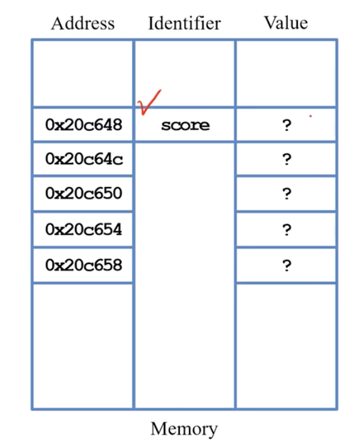
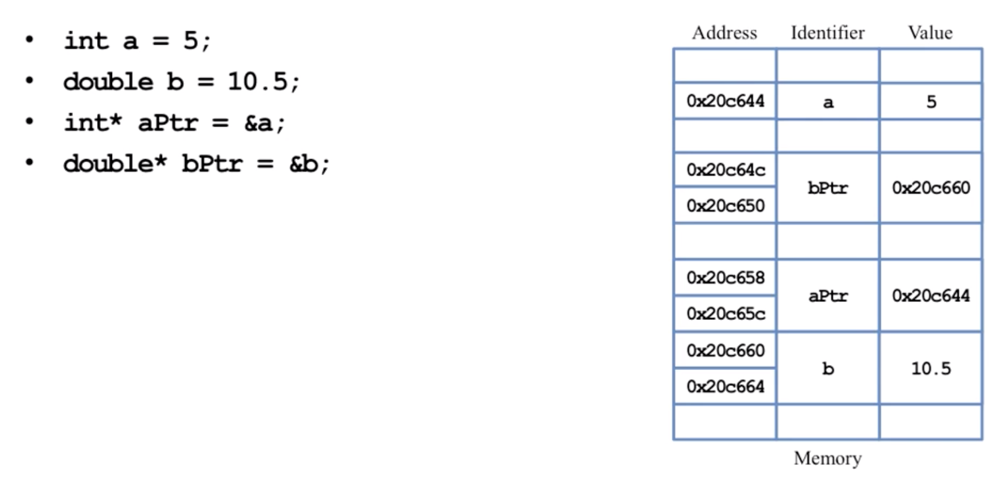

# 如何跑C++

- 使用code Runner然後跑

## 基本的C++


```c++
#include <iostream>
using namespace std;

int main() // 從這行開始，只能有一個
{
  cout << "Hello World!你好 \n";
  return 0;  // 表示結束
} // 從這行結束
```

- `cout << `：是一個pre-defined的物件（console output），把傳給他的資料傳到顯示螢幕。`<<`(insertion operator)是讓資料流過去，也可以把程式串起來
- `cin >> `：輸入資料

```c++
cout << "Hello world" << "I love C++"
```

- C++一定要自己宣告變數型態(datatype)

## 基本概念

- bool：1 bytes
- char：1 bytes
- int：4 bytes
- float：4 bytes
- double：8 bytes

```c++
int myInt //這時就會開一個int的記憶體空間
```

## 記憶體

- 當電腦宣告變數，就會挪出一個memory space

```c++
int main(){
    int num1=13 , num2=14 // 產生兩個記憶體位置放num1,num2
    cout << num1+num2 // 產生一個暫時的記憶體位置放27
}
```

# 陣列

`datatype arrname [number of element]`：

```C++
int ball[5] // 表示一個有5個元素的array，每個元素是int(4byte)，因此總共是20byte
```
- 陣列的元素在記憶體的位置會是連續的，例如ball[0]、ball[1]、ball[2]會是連續的
- sizeof(ball) 會印出陣列的大小(Bytes)

## 陣列初始化

```C++
int data[] = {1,3,4} // 會自動把array的大小設為3
int data[3] = {1,3,4,5} // error
int data[10] = {1,3,4,5} // ok
int data[10] = {0} // 產生10個0，如果不初始化記憶體上可能是之前殘留的東西
```


## 陣列記憶體位址

1. cout << score << "\n" 會印出該陣列的`起始位置(beginnng address)`


```c++
int score[5]
// 當score[5]被宣告時，會有5個記憶體位置會被送給score。
```
 



2. 記憶體位置可以平移，比如說data+1就會是data位址的下1個單位單位，data[n] 可以被視為平移n單位

```c++
int main()
{
    int data[3] = {1,2,3};
    cout << data << "\n"; // 0x7ffee072830c
    cout << data +1 << "\n";// 0x7ffee0728310
    return 0;  
}
```


3. 陣列超取：陣列存取陣列時可以超過邊界，但無法預期邊界之外的記憶體中裝什麼變數

```C++
int main()
{
    int data[3] = {1,2,3};
    for(int i=0 ; i<5; i++){
         cout << data[i] << ";"; //不會出錯
    }
     return 0;  
}
```

## 動態陣列宣告


```C++
// 正確的寫法
int x = 0
cin >> x
int* array = new int(x)
array[2] =3
```


```C++
// 錯誤的寫法，因為在runtime時，x不存在
int x = 0
cin >> x
int array[x]
array[2] =3
```

## 好的coding style

- 把陣列的長度寫成const

```C++
const int VALUE_LEN = 10
int ar[VALUE_LEN] = {}
```

### 陣列長度

```c++
sizeof(data)/sizeof(data[1])
```

# Class

- class就是自訂的dataType

# 指標pointer

- 指標（pointer）是一個變數，他會存記憶體位址
    - 32位元：會用4byte，儲存記憶體位址
    - 64位元：會用8byte，儲存記憶體位址

`*`：宣告指標，表示該變數用來儲存某個型別的地址

```c++
int *ptrInt //一個指向整數的指標
cout << sizeof(ptrInt) << '\n'; //會印出8
```

`&`：取地址

```c++
int a=5
int *ptr = &a // 把a的地址給ptr當值，但ptr本身也有自己的地址
```

