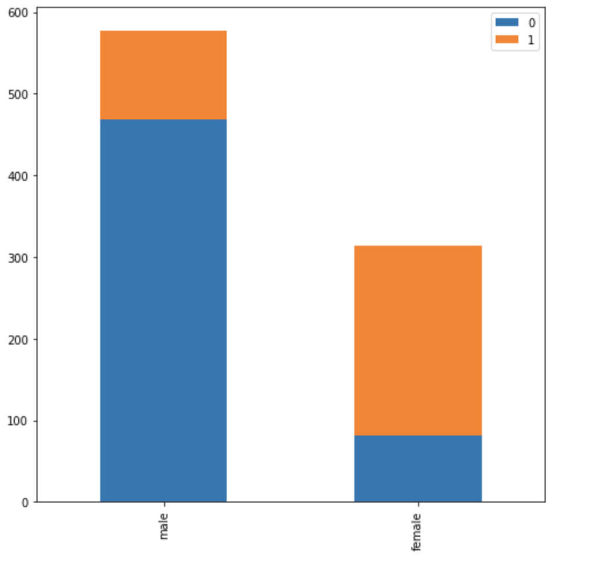

# Matplotlib 資料視覺化

- https://matplotlib.org/
- [Example](https://matplotlib.org/gallery/index.html)

## 安裝與使用

```
pip3 install matplotlib
```

```
from matplotlib import pyplot as plt
import matplotlib
```


## Plot 圖


- df.index=['a','b']
- df.plot(kind='bar',stacked=True,figsize=(8,8)

```
## male_survived
0    468
1    109

## female__survived
1    233
0     81
```

```py

df=pd.DataFrame([male_survived,female__survived])
df.index=['male','female']
df.plot(kind='bar',stacked=True,figsize=(8,8))
```

