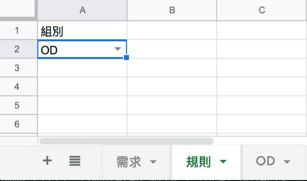

## 如何寫google sheet Script

-  需求：當A2這個格字的值是OD時，就會顯示OD這個sheet（其他ER、TS的sheet就消失）




```js
function myfunction(){  //主要的函式
}

function onEdit(event) //當編輯的時候就會啟用這個函式
{
  var activeSpreadsheet = SpreadsheetApp.getActiveSpreadsheet(); 
  var sheet1 = activeSpreadsheet.getSheetByName("規則");
  var cell1 = sheet1.getRange('A2');
  
  var ER_sheet = activeSpreadsheet.getSheetByName("ER");
  var OD_sheet = activeSpreadsheet.getSheetByName("OD");
  var TS_sheet = activeSpreadsheet.getSheetByName("TS");

  
  if (cell1.getValue() == 'OD') {
    ER_sheet.hideSheet();
    TS_sheet.hideSheet(); 
    OD_sheet.showSheet();
  }
  if (cell1.getValue() == 'ER') {
    OD_sheet.hideSheet();
    TS_sheet.hideSheet(); 
    ER_sheet.showSheet();
  }
  
  if (cell1.getValue() == 'TS') {
    OD_sheet.hideSheet();
    ER_sheet.hideSheet();
    TS_sheet.showSheet();
  }
}
```