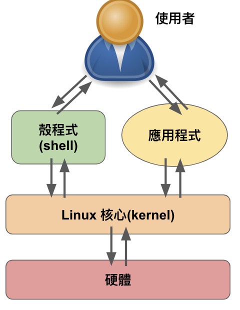

# unix系統

## Linux

- 開發者：Linux Toravalds
- 免費自由開放的軟體
- 允許多人/多工處理環境：允許多使用者同時登入使用，良好資源分配
- 安全性與穩定度高：嚴格權限控管，穩定套件更新
- 高度的可攜性與擴充性：
  - 大型工作站
  - 個人電腦
  - 嵌入式系統

系統架構= 核心(Kernel)＋殼程式(shell)

我們可以透過應用程式（Application） or 殼程式(shell)，去和核心(Kernel)溝通，然後Kernel就會去與硬體溝通。

常見的發行版本：CentOS, Debian, Fedora , Gentoo, UBUNTU等

### UBUNTU

虛擬機是什麼
- 一種可以用模擬硬體（如電腦）的軟體應用程式
- 可以分為
  - 程序虛擬機器：Flash player
  - 系統虛擬機器：Virtual Box