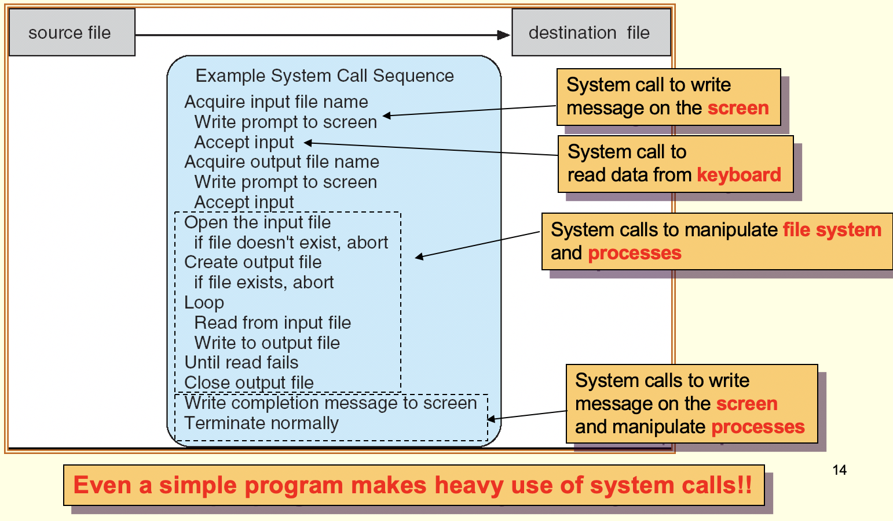
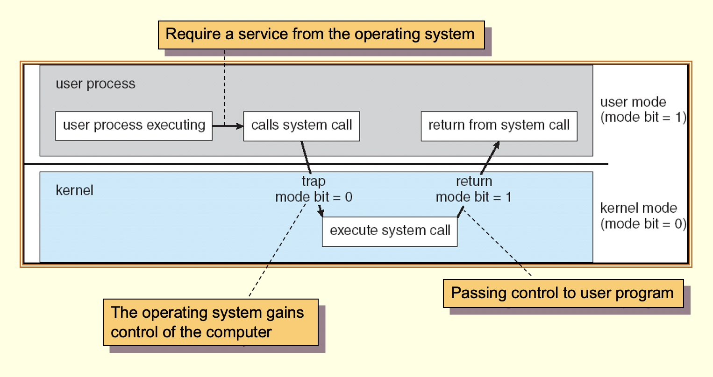
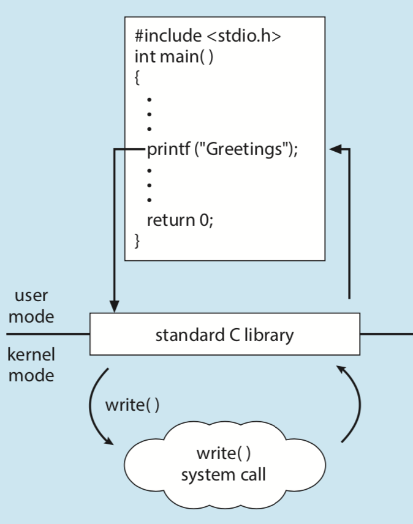

# 作業系統

- 陳建錦老師（資管系）

- 名詞介紹
    - **作業系統**(Operating System)？
        - 定義：user and hardware之間的中介（**intermediary）**
            - 記憶體當中會有OS和許多user processes，OS就負責分配CPU資源
            - Resource allocator：去管理分配運算資源
            - control program：去管理program可以如何使用資源
        - 電腦的四層結構
            - 1.**hardware**：computing resources，例如：CPU/memory/ IO device
            - 2.**operating** system：管理不同application之間如何使用hardware資源
            - 3. **application** system：利用資源進行計算（例如：database ,web browser)
            - 4. **Users**：people,machine other computer
        - 不同情境下的OS與其目標
            - Mainframe大型主機：被設計給多使用者，專注把資源給分配不同process，讓資源分配最佳化
            - PC：被設計給單一使用者，OS的設計專注於當下的process，把資源給讓user覺得使用起來順暢
            - Workstation：介於「多人」和「單一使用者」，會專注於
            - Handheld computer：比起注重效能，可能同時也很在意電池的生命週期
    - 計算機結構
        - Storage Structure
            - CPU：主要計算的單元
                - register
                    - 是一個存在於CPU的結構，運算速度最快，但容量最小
                    - content register：
                    - instruct register：
                    - 主要從main memory和disc獲取資料
            - main menory：CPU能直接access到資料的最大單元（因此disc如果有程式一定要先load到main menory裡面，不然CPU會讀取不到）
                - 主要放兩個重要的資料：program、data
                - 相對於CPU有一個更大的容量，但不可能儲存所有的program、data
            - Disc：放置大量資料，但是CPU無法直接讀取
                - 平時會放一些程式，等到需要時就把程式放到main menory當中
        - IO Structure
            - Device controller
                - Device controller是硬體上實體電路，負責幫CPU執行指令，操作device的結構。例如：CPU想讀取硬碟的資料，就透過硬碟的controller就幫忙執行。
                    - 當硬碟取得特定資料，就會把data放到local buffer
                    - CPU收到通知後會把data從local buffer搬到main menory
                        - interrupt 機制
                            - 當device完成運算後，就會讓bus去通知CPU進行interrupt，把buffer的資料趕快取出來
                                - 因為device的local buffer是有限的，所以資料不趕快讓CPU拿走，運算就會浪費
                                - CPU每執行一些程式，就會去偷看interrupt-request line是否有device完成運算，並且趕快去執行。
                                    - 每一個request會有一個特殊的數字（interrupt vector）代表是哪個device完成運算（transfer control to a generic routine）
                                    - 知道是哪個device的訊號後，Kernal就會透過裡面的table去尋找對應的程式去執行（interrupt-specific handler）
                                - CPU去救buffer時，會去state save，並且 transfer control to a genric routine
                                    - transfer control to a generic routine
                                        - interrupt-specific handler
                            - hardware跟software都可以拉innterupr

                - 通常會有local buffer，等到CPU去把buffer的東西丟到memory
                - 
            - Bus
                - 不同device之間或是device和CPU之間的橋樑（電路），會幫忙contoller去和CPU溝通，像是發出interupt。
            - Driver
                - 每一段時間就會出新的設備像是網路卡，但是OS並不認識這個設備，所以就需要安裝硬體廠商提供的driver，安裝之後這些driver會被整合進OS裡面，讓OS可以去和硬體溝通。
                - OS會提供一個標準interface（read/write...等），而硬體商就必須寫符合規範的Driver提供這些function。

    - processor system 處理器系統
        - single processor system 單一處理器系統
            - 顯示卡的GPU，可以算是一種處理器
            - 大多數設備的controler，可以算是一種處理器
        - Multi processor system 多處理
            - 有多個運算單元，可以進行平行運算
            - 多處理器的好處
                - 相較於多一台電腦，需要更多硬碟、顯示卡等資源，多處理器可以共用電腦資源
                - 增加穩定性，避免當機的問題
    - multiprocessing 多工處理
        - 現在的CPU都有許多核心（core）因此其實也是multiprocessing，因為同在一個CPU。所以比起CPU之間必須透過Bus溝通，多核心的速度比較快一點。
        - Asymmetric multiprocessing 非對稱處理
            - 一個master處理器會負責分配任務給其他的處理器(master-slave relationship)
        - Symmetric multiprocessing 對稱處理（SMP）
            - 每個處理器都一起處理運算，可能會產生運算工作不平均的狀況
            - 大家會共用一個quene，其中一個處理器沒有任務就補上

    - Multiprogramming  VS Multitasking
        - 記憶體：operating system+許多user processes
        - 根據算法CPU會提供其中一個user processes，如果Process需要等待IO，CPU就換給別人運算。
        - multiprogramming
            - user process會不停計算，直到IO產生interupt，「不得不」中斷去讓其他process拯救資料
        - multitasking（Time sharing）
            - CPU會給予一定時間，讓不停切換user processes，而不是「不得不」暫停的狀況
    - 經典的流程（OS如何分配資源給不同的程式）
        - Proccess 1在進行運算，但途中會需要IO的資料（例如：read磁碟之類的），這時候CPU就會去讓 IO controller去跑運算，這時候因為Process1的資料還沒有回來無法運算，因此CPU就讓給P2。
        - 當IO完成→controller就會發一個編號
        →OS會根據talbe執行自OS裡面對應程式（有一個table，對應「編號」跟「跑程式」）
        →對應的程式會去回收IO的buffer資料（不趕快回收buffer的空間有限，會丟失資料）
        →回收完資料後，恢復讓Proccess2運行程式
        →等到Proccess2的500msc時間到，就可以讓Proccess 1執行程式
        - 概念：在記憶體中會有許多程序，還有OS（OS自己本身有許多程序，比如說去救buffer）
    - Kernal
        - 從開機就會一直執行的program

    - Computer-system operation
        - CPUs
        - disk controller
        - USB controller
        - graphics adaptor
    - 作業系統的設計模式
        - Monolithic Structurt：想到什麼開發什麼哈哈
        - layer設計：有一種作業系統的設計方式是用layer實現，每一層只能使用下層的服務。但是現在很少用，因為有時候不同層會需要溝通，所以就變得很麻煩。（有也不會有很多層）
        - microkernel設計：CMU教授發明的作業系統，優點是非常輕量級，他把許多系統放在application layer（像是file system），號稱只有幾千行而已。但是缺點是很慢，比如說想要呼叫file system服務，就要先叫OS，OS再去叫file system。
        - Modules（現行）：把常用的服務放在core sytem裡面，其他就用module的方式設計。好處是像是有layer的interface，有microkernel的core。
    - 
    - Program VS Process 的差異
    - **Deadlock** 死鎖
        - A同學去拿硬碟→影印機，B同學去拿影印機→硬碟。結果A去影印機時，因為B佔用資源就過不去。B同學要使用硬碟時，因為資源被佔用。2個人都互相無法進到一下個階段，就產生所謂的Deadock。
    - **Synchronization** 是什麼？
        - process可能因為memory sharing有產生衝突的狀況，程式就會產生意外的狀況
            - 假設i是5，同學A寫i++，同學b寫i- -，最後預期結果是5
            - 同學A寫i++，翻譯成低階語言就是

                1. 把i從記憶體拿出來放到CPU register
                2. 執行i++
                3. 把i放回記憶體

            - 同學b寫i- -，翻譯成低階語言就是

                1. 把i從記憶體拿出來放到CPU register
                2. 執行i- -
                3. 把i放回記憶體

            - 因為OS會輪流讓process在不同時間使用，所以假設A同學proces停在2並執行完b的程式
                - A在step2時，此時register中是6
                - B完成了計算，因此記憶體中是4
                - A回去完成step3，此時register的6就被放回去記憶體，因此變成6

    - bootstrap program
        - 當電腦被開機時，主機板的RAM會有一支boot程式負責初始化設備
            - boot會去檢查CPU、memory、網路卡這些設備
            - 去disk把作業系統load進去memory
        - ROM（read-only memory）
        - 
    - program counter
        - 為了儲存「下行程式碼」的在記憶體的位址
        - 比如說A程式被打斷跑到第10行，就會把他在program counter儲存起來，然後下次就知道可以繼續回來執行
    - Multi-threaded programming
    - User interface
        - CLI：系統如何實作cml
            - 常見的「ls、mkdir」等指令會寫在「/bin」或是「/sbin」資料夾下面，例如

                    執行 rm file.txt
                    去/bin/rm 找到rm檔案，並把它load到memory中執行

            - 如果有新的指令出現，就會去「$PATH」看該指令是否可能在其他目錄（例如Python和Node的bin），以下是echo $PATH的結果

                    /Users/nissen/.nvm/versions/node/v10.15.0/bin:/usr/local/Cellar/node/12.12.0/bin:/Library/Frameworks/Python.framework/Versions/3.6/bin:/usr/local/bin:/usr/bin:/bin:/usr/sbin:/sbin

        - GUI
        - Batch：
    - 
    - Program execution
    - Concurrency是什麼？
        - 意思是「同步進行」
        - Fake Concurrency
            - 一般使用者用電腦時，會同時開很多Process（Notion和音樂），這時他們會感覺是同時的concurrency
            - 但這並不是真的同步，而是OS 會快速切換不同process，讓user 覺得可以同時跟很多 process互動
        - Real Concurrency
            - I/O device 和 CPU是真正的同步，例如CPU去通知硬碟controller後，就可以回去執行其他process，而是device controller就可以同時讀取硬碟。
    - Virtual Memory 虛擬記憶體
        - 在以前如果記憶體已滿但process又需要記憶體，就會去把整個需要process搬進去記憶體，並把不需要的process整個搬出來。
        - 但在Virtual Memory的時候，就不需要把整個process搬進去，而是把部分重要的部分搬進去就好。
    - Storage management
        - 
    - POSIX
        - 
    - Single thread vs Multi-thread
        - Multi-thread：
            - 
            - 每一個thread，都有program-counter
        - Single-thread
            - 每一個thread，都有
            - 
    - OS如何保護資料
        - 
    - Caching 快取
        - CPU裡面會同時有「register＋cache」的結構，當register需要資料時，會優先去詢問cache，他可以減少register去memory要資料的狀態。
        - 資料通常會存取在比較底層的結構（硬碟、記憶體），然後一層層的往上層去存取。

            

## System Call

- 每個system call就是OS裡面的不同的process
- system call是什麼？
    - 作業系統提供的interface，讓其他人可以執行工作（通常用c/c++寫，一些用組合語言寫）只有
    - 範例：僅僅只是想要「複製檔案」就會牽涉非常多的syste call

            cp in.txt out.txt  // 牽涉非常多的syste call

            - 獲取keyboard來的輸入
            - 獲取screen資源，把文字顯示出來
            - ....
            - ....

        

    - 因為呼叫一堆system call還是太麻煩了，所以就會把他們包起寫成system call interface（也就是API），例如printf就是一種API

            比如說在寫C的時候：
            1.呼叫printf()
            2.C library 幫我們執行write() 還有一堆複雜的system call

        

    - system call 的執行必須在kernal mode（mode bit = 1 ）執行，因為它牽涉到資源使用
    - 什麼是Dual-mode？：user mode & kernel mode 雙模式轉換
        - CPU會有user mode和 kernel mode，當user mode時表示是user的程序在用CPU，執行 kernel mode的時候表示是OS再用CPU。
            - 不同的模式被定義在硬體中，硬體的bit是1，就是user模式，否則是kernel模式
        - 假設user process想執行一些系統的權限（例如：開檔案），就必須去呼叫kernel，讓kernel去執行system call，才能去對硬體下指令。

        

        - 當遇到interupt的時候，CPU就會轉變到kernel mode，執行kernel中的程序，去拯救系統的buffer
    - 作業系統中有300種system call
    - 每當我們要需要kernel幫我們執行system call ，就必須透過軟體發出softeare interupt
    - EAX register：把system call對應編號放在EAX→呼叫128中斷
    - 例子：僅僅只是想要「印出檔案」，也會牽涉到很多
        - C語言

            #include <stdio.h>
            int main(void)
            { 
               printf("hello world\n"); 
               return 0; 
            }

        - 背後C libiary會去幫忙執行system call

            [root@Pomelo-14-61 LKMP]# strace ./hello
            execve("./hello", ["./hello"], [/* 26 vars */]) = 0
            brk(0)                                  = 0xf4c000
            mmap(NULL, 4096, PROT_READ|PROT_WRITE, MAP_PRIVATE|MAP_ANONYMOUS, -1, 0) = 0x7f0129b0e000
            access("/etc/ld.so.preload", R_OK)      = -1 ENOENT (No such file or directory)
            open("/etc/ld.so.cache", O_RDONLY)      = 3
            fstat(3, {st_mode=S_IFREG|0644, st_size=91141, ...}) = 0
            mmap(NULL, 91141, PROT_READ, MAP_PRIVATE, 3, 0) = 0x7f0129af7000
            close(3)                                = 0
            open("/lib64/libc.so.6", O_RDONLY)      = 3
            read(3, "\177ELF\2\1\1\3\0\0\0\0\0\0\0\0\3\0>\0\1\0\0\0000\356\341p3\0\0\0"..., 832) = 832
            fstat(3, {st_mode=S_IFREG|0755, st_size=1926800, ...}) = 0
            mmap(0x3370e00000, 3750152, PROT_READ|PROT_EXEC, MAP_PRIVATE|MAP_DENYWRITE, 3, 0) = 0x3370e00000
            mprotect(0x3370f8b000, 2093056, PROT_NONE) = 0
            mmap(0x337118a000, 20480, PROT_READ|PROT_WRITE, MAP_PRIVATE|MAP_FIXED|MAP_DENYWRITE, 3, 0x18a000) = 0x337118a000
            mmap(0x337118f000, 18696, PROT_READ|PROT_WRITE, MAP_PRIVATE|MAP_FIXED|MAP_ANONYMOUS, -1, 0) = 0x337118f000
            close(3)                                = 0
            mmap(NULL, 4096, PROT_READ|PROT_WRITE, MAP_PRIVATE|MAP_ANONYMOUS, -1, 0) = 0x7f0129af6000
            mmap(NULL, 4096, PROT_READ|PROT_WRITE, MAP_PRIVATE|MAP_ANONYMOUS, -1, 0) = 0x7f0129af5000
            mmap(NULL, 4096, PROT_READ|PROT_WRITE, MAP_PRIVATE|MAP_ANONYMOUS, -1, 0) = 0x7f0129af4000
            arch_prctl(ARCH_SET_FS, 0x7f0129af5700) = 0
            mprotect(0x337118a000, 16384, PROT_READ) = 0
            mprotect(0x3370c1f000, 4096, PROT_READ) = 0
            munmap(0x7f0129af7000, 91141)           = 0
            fstat(1, {st_mode=S_IFCHR|0620, st_rdev=makedev(136, 1), ...}) = 0
            mmap(NULL, 4096, PROT_READ|PROT_WRITE, MAP_PRIVATE|MAP_ANONYMOUS, -1, 0) = 0x7f0129b0d000
            write(1, "hello world\n", 12hello world
            )           = 12
            exit_group(0)                           = ?

        

- system call的類型
    - Process control 負責控制過程流程
        - end & abort：

                main(){
                
                 return // 對應的就是end，去讓OS幫忙清掉記憶體
                }

        - load & execute

                main(){
                	hello()  //對應就是load & execute
                }

        - wait time & event

                main(){
                	hello()  
                }
                
                // main()必須要wait，等到hello()完成才能繼續

    - File management
        - create & delete
        - open & close
        - read,write & reposition
    - Device Management
    - 

## 如何中斷程式

1. 當使用者程式呼叫system call時，就會執行一個software interupt，把參數放在stack

        ...
        printf() //發出software interupt

2. 跳到generic Interrupt routine：kernel會去看「恩？到底誰叫我？」
3. Interrupt Service Routine（ISR）：Interrupt Service Routine是一個process，他會幫忙把request送到CPU，然後執行對應的system call。
    - 裡面有300system call的表格，系統會去查詢這個表格，system call去stack把參數拿出來

## Communication

- 可能有很多平行運算的process，他們同時在做一件事，但最後需要整合，就會需要有溝通的機制。
- Message-passing model
    - 一個程式把資料傳到另一個程式
- Share-memory model
    - 創造一個記憶體空間，不同的process可以共用這些內容
    - 但是可能會遇到conflix的問題

It handles the request and sends it to the CPU, interrupting the active process. When the ISR is complete, the process is resumed.