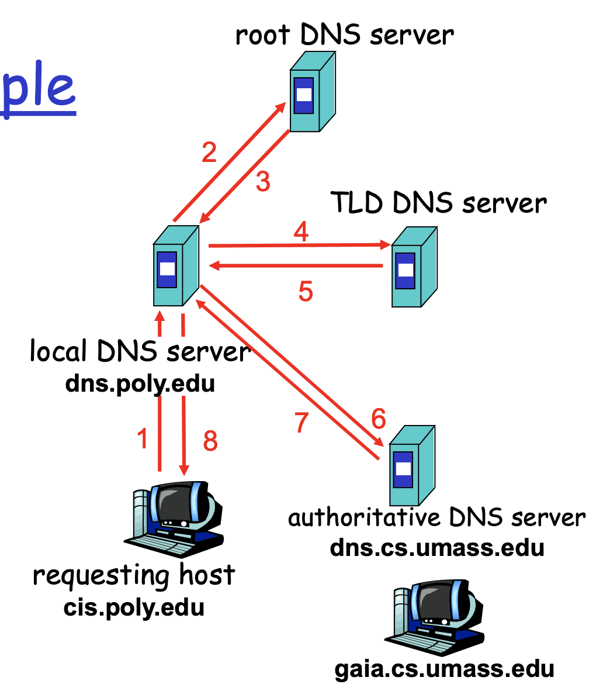
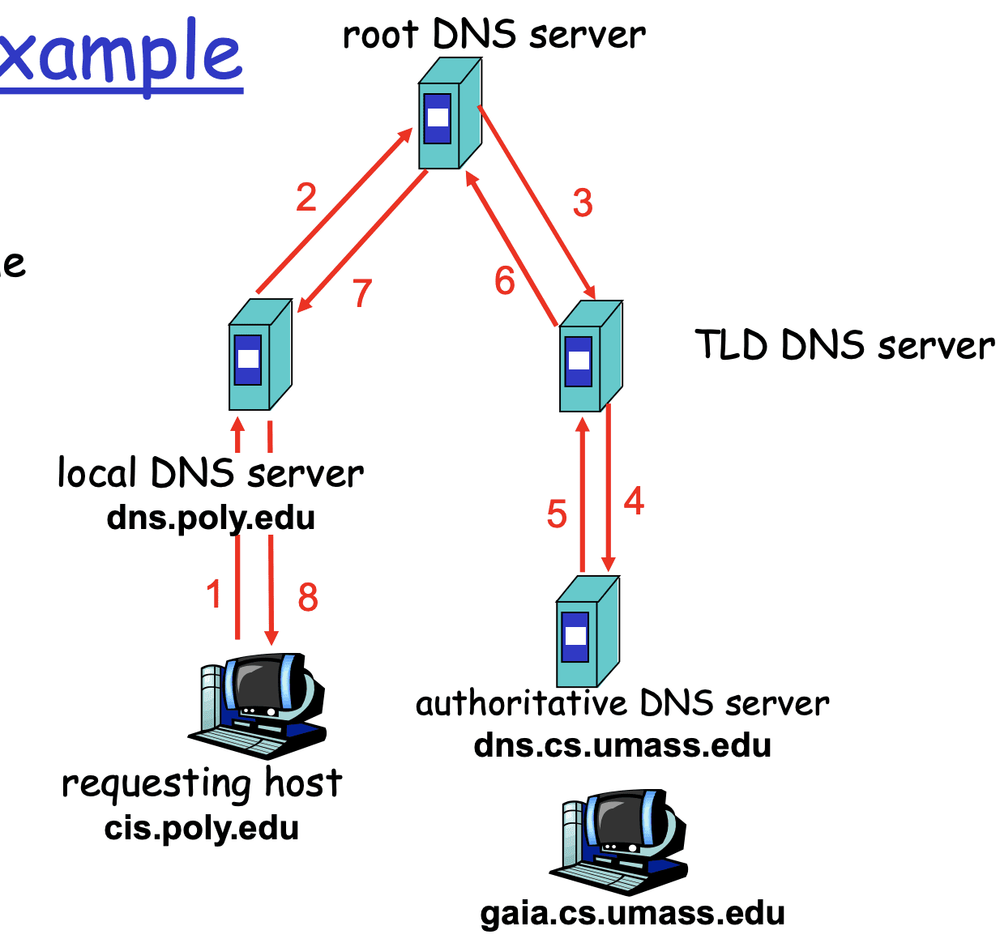

# DNS（Domain Name System）

擁有階層架構（hierarchy），可分為

1. Root DNS Servers：分發到 com, org, net, edu 的DNS server上
2. Top-level domain (TLD) servers：分發到個server
3. Authoritative DNS servers：負責提供IP,hostname的mapping

當使用者想去尋找 amazon.com 的時候，會先把query發到local DNS server(每個ISP都會有一個），然後它
- 會去root server 去找 com DNS server在哪
- 會去com DNS server 去找amazon.com DNS server在哪
- 會去 amazon.com DNS server 去找到www.amazon.com 的IP是什麼

# 不同的路徑

- iterated query:

- recursive query

