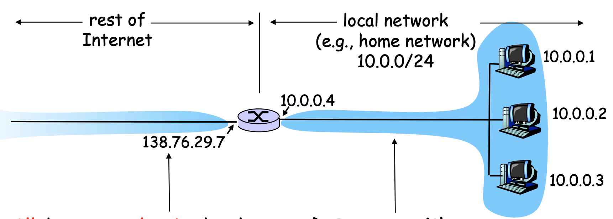
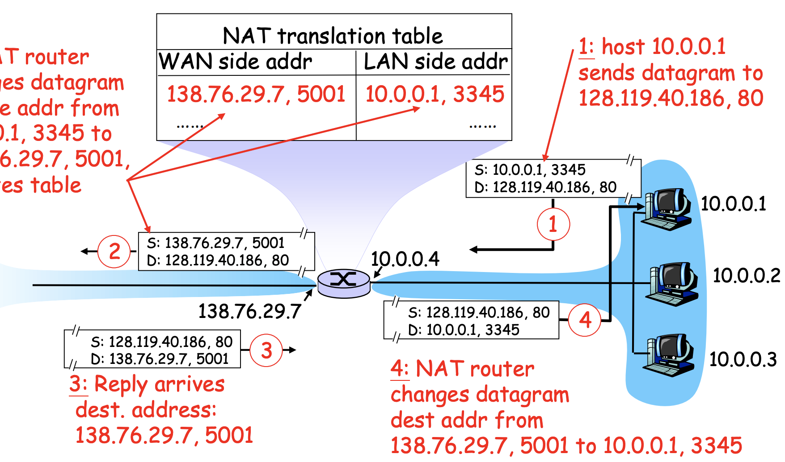
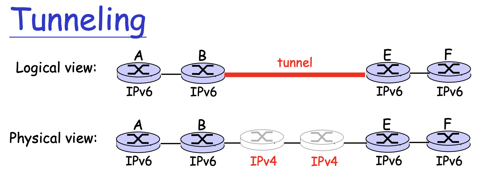

# IP

MTU

## IP address

mac address是不會變的，然後要拿IP address問Switch的mac address是誰。

IP address的分佈

現在大家從THCP拿到的IP address通常都是虛擬的，而Physical IP address是很少的，總共有32bit，host和router連接的

IP共用四個數字代表，然後總共32bit（例如223.1.1.1）

subnet part(high order bits)：如果在同一個subnet下，意思是說這個區域裡面不需要router幫忙傳資料，也可以互相傳送檔案。在

host part（low order bits)：

CIDR:a

200.23.16.0/23
前面是IP address（前面23），後面9個是host part。

## DHCP（Dynamic Host Configuration Protocols）

DHCP會在幫加入該網路的人給予IP，讓host可以動態的獲取IP。一般的使用者會用DHCP，DHCP會給一個lease time，如果太久沒用，他就可以把IP讓給別人。

IP address跟物理位置有關係，雖然都是在同一個設備，但是還是會得到不同的IP。

當開機時，設備一但連到網路（例如ＷＩＦＩ)
- DHCP discover：去在網路下面尋找DHCP server
- DHCP offer:DHCP server表示我在，把自己的IP address回傳。
- DHCP request：去請DHCP server給address
- DHCP ACK：DHCP把IP回傳給他

>前面四個位數都是255.255.255.255.67，就表示這是一個bordcast，

## NAT(Network Address Translation）

NAT（`Network Address Translation`）：當使用NAR的時候，即使區域網路裡面有n個虛擬網路，出去時都會通用一個IP。當host要送出封包時，會把自己的虛擬IP還有port送給NAT，然後當NAT收到時就會幫忙把header換掉，把虛擬IP換成真正存在的IP，並且送到真正的地方。

在NAT裡面會有一個表格，紀錄對應的IP（內網的虛擬IP&poer還有對應的真實IP＆port），這樣當外部的資料回來時，就會知道可以送回哪一個host。如果有人要把資料傳給內網的host，也是透過該表格進行查詢。

## ICMP（Internet Control Message Protocol）

ICMP是一個錯誤報告協議

## IP

目前IP的協議還是使用IPv4，未來逐漸會改成IPv6。

IPv6是一個32bit的address，跟IPv4不同，他的header裡面包涵Priority、Flow label等功能。目前大家相信IPv6的時代會漸漸到來，一些router會慢慢升級到使用IPv6。

目前解決方式IPv6的router可以向下兼容IPv4，它會裝上IPv4看得懂的header，然後送到IPv4的router。

