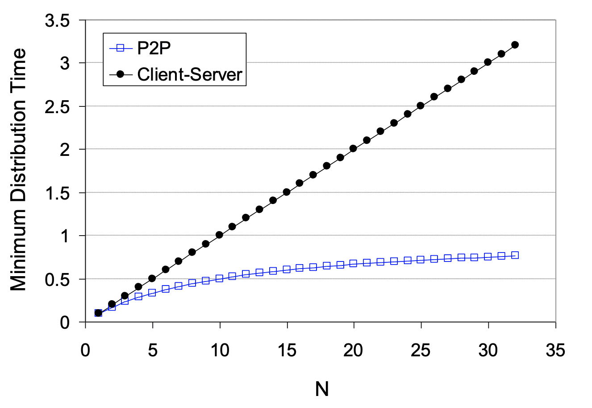

# Client-Server架構

藉由Client去尋找Server的方式，把Server的檔案下載下來。

Server特性
- 伺服器永遠是啟動的
- IP位置必須是永遠不變的，不然大家找不到它

Client特性
- 使用動態的IP

# P2P架構

只要一個host把檔案下載下來，之後就可以把檔案與其他的host互相傳播。在以前，server的內容都需要付費，因此流行P2P。但是在現在，許多內容提供商改用廣告付費的商業模式，從server下載檔案變得更加容易。（例如：foxy、Skype都是屬於P2P架構）

特性：
- 可以不用永遠開啟
- IP位置可能會變動

以BitTorrent為例：BitTorrent是之前流行的P2P軟體，「下載方」會得到誰有檔案的列表，然後去向那些人要求下載一部分的檔案。而「提供方」只會把檔案給曾經給那些曾提供檔案的前4名，所以如果有人不提供檔案，那他就會下載的比較慢。

## Client-Server和P2P混合架構

Skype是一種混合架構，在通話之前是Client-Serve架構，但通話時是P2P架構。

- Skype在確認身份時會使用Client-Serve架構，讓server確定雙方身份，但是一但通話後，為了保持通話順暢，當通話時就使用P2P架構。（Skype使用的protocol是非公開的，所以大家不太能做跟他一樣的東西）

- Wechat和line可能也是Hybird架構，但也有可能不是，因此通話時還是有經過Server，所以紀錄通話訊息。
也是Hybird架構，但也有可能不是，因此通話時還是有經過Server，所以紀錄通話訊息。

理論上傳送的檔案愈多，Client-Server的速度愈慢，P2P的架構愈快（但這是理想狀況）

