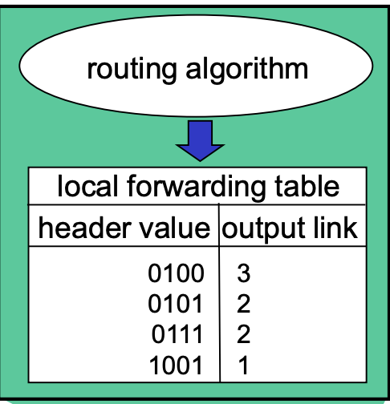

# Router 路由

## 路由的工作

- `routing`：決定封包的起點（source）和終點（dest）。
- `forwarding`：查詢相關的表，然後把收到的封包，轉到適合的出口。在出口的部分，每個路由可能會有不同的政策去處理順序。

路由上會有會根據`header value`中`終點的IP位置`去計算要送到哪個output。

## Protocol

- Routing Protocols：用來和其他router溝通，協調好路徑。（RIP（
- IP Protocols
- ICMP Protocols：確認網路的error，看其他router是否還活著。

## IP Header

相關資訊

- ver：看是用IPv4或是IPv6
- type of service：表示優先處理該封包（但實際上router根本不看）
- time to live：用來避免packet一直被loop
- source IP address
- destination IP address

> IP header大概20個byte，TCP header也大概20個byte。

IPv6

