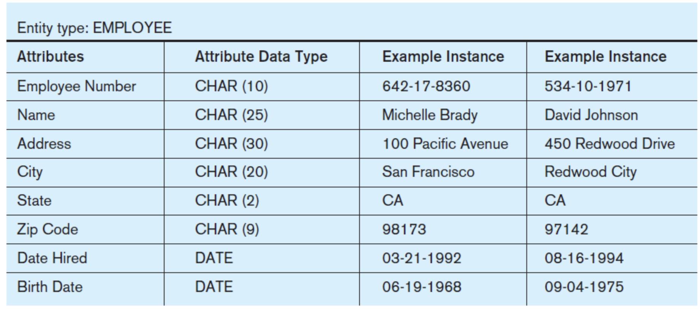
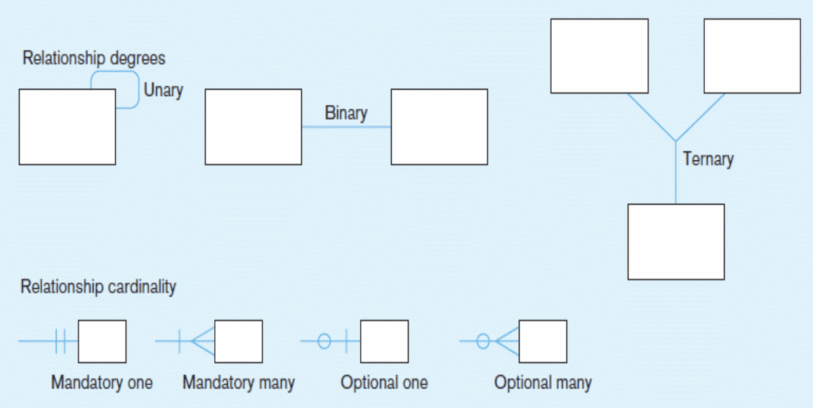
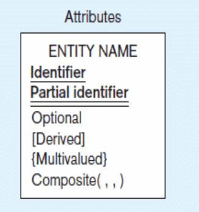
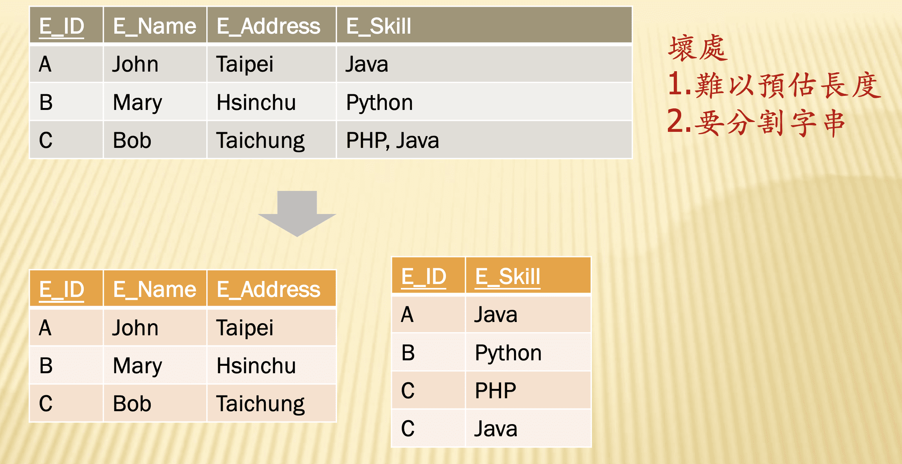
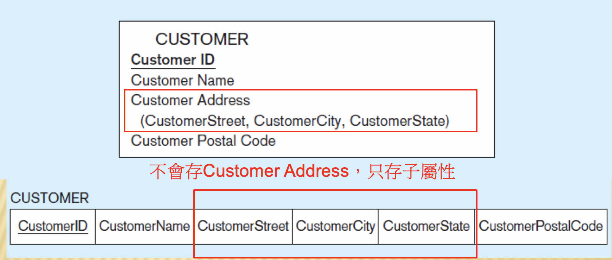
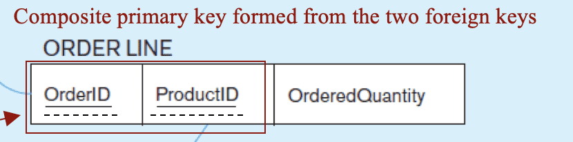
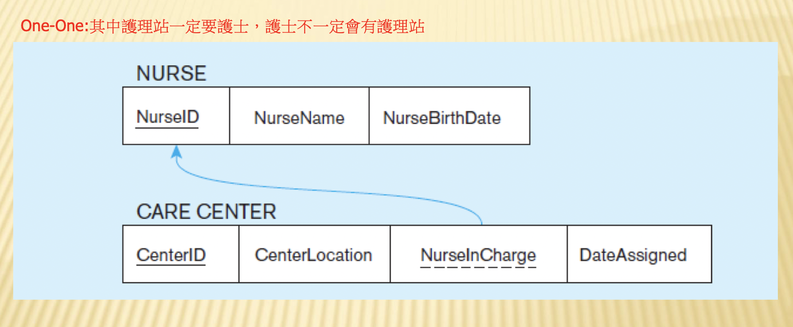
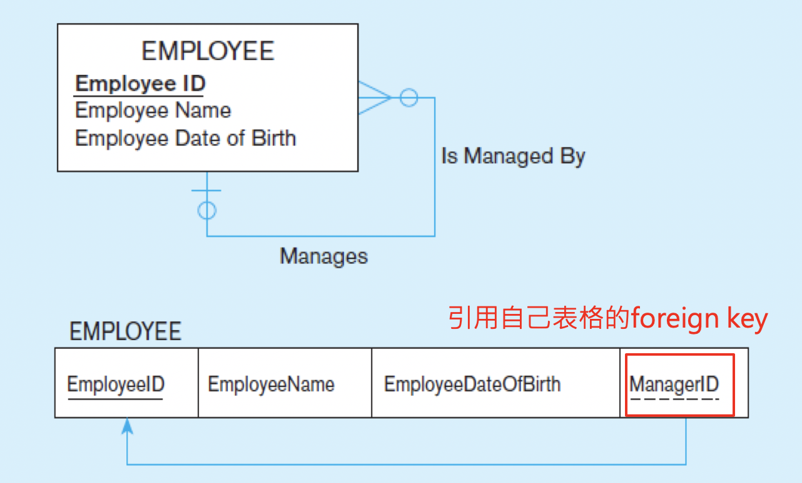
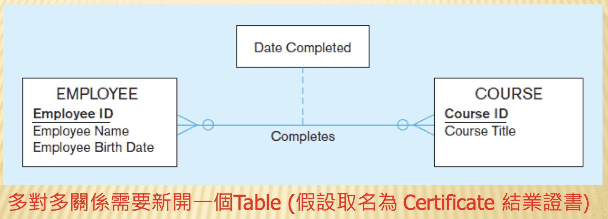
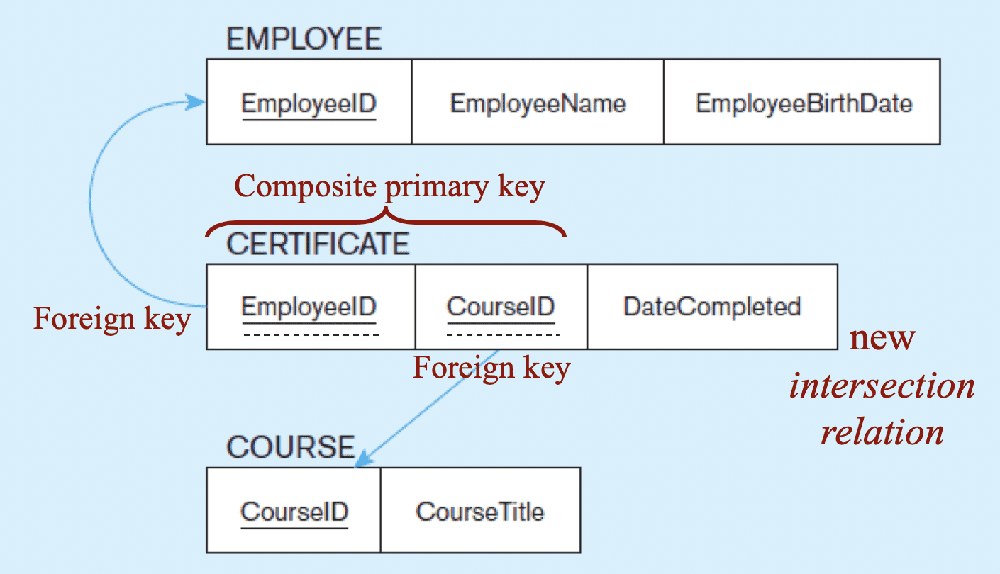

# ER model

ER model主要分為三個部分：

- 個體（Entity）
  - Entity Type：可以是一的地點、人、物件、概念
  - Entity instance：例如台中、小明、小華（通常是table中的一列資料）

- 關係（Relationships)
  - Entity Type
  - Entity instance：真正連接兩個Entity（個體）的link

- 屬性（Attribute）：
個體和關係當中的屬性（通常是table中的一欄資料）

> 通常沒有更多欄位的就是Attribute，有更多延伸欄位的是Entity。

## 繪製ER-model的技巧

1. 先釐清有什麼BUSINESS RULES

例如：學校委託你整頓圖書館，你依照學校開出的需求
（business rules）重新規劃資料庫，以本校之圖書館為限，包含多個分館
- 需建立完整書目資訊，每一書目有多本藏書
- 書目資訊至少包含 Dublin Core 的前10個欄位
- 每一本藏書只會歸屬於一個分館
- 每一本藏書都有獨立的藏書號與藏書日期
- 需建立書目來源（出版商資料）
- 借書人為學生，每人可以借多本書，需建立借書紀錄

2. 訂出有什麼Entity

出版商、書目、書、學生

3. 訂出Entity之間的關係

- 一個出版商可能出多本書，一本書只有一個出版商。
- 一個書目對應多本書，一個書目對應多個出版商
- 一個書可以被多個學生借，一個學生可以借多本書

## 實體（Entity）

一個 Entity Type就是一個表格，裡面可能包含許多的Attribute，例如學生 ID、姓名、年齡...等，有多個欄位的就是一個 Entity（實體），如果沒有更多衍生的欄位就只是Attribute（屬性）。

Entiy Type可以簡單分為

1. Strong Entiy
2. Weak Entity（依賴於Strong Entiy，不能單獨存在，例如：員工與其扶養親屬）
3. Associative Entiy

### 運算結果不要存成實體

注意運算結果不要存成實體（除非是想加速運算）

運算結果像是從費用和產品計算出費用報告

### 命名建議

- 單數
- 看了就懂：如果只有一種學生，可以student就好，不用ntuStudent。
- 可讀性高
- 有固定命名規則
- 使用結果而非過程命名：例如訂購單，而非訂購

## RelationShip（關係）

關係又分成
- `Relationship Degreee`：表示Entity之間的關係，分為 Unary, Binary, Ternary。
例如：(1)在人的人的關係中，人可以跟人結婚。但因為只牽涉一個「人」的Entity，因此該關係就是Unary；(2)在課程和學生的關係中，因為牽涉到多個Entity，因此是屬於Binary的關係。
> 研究顯示，三元關係都可以被二元關係表示。
- `Relationship Cardinality`：表示Entity的屬性（Attribute）之間的關係，分為 one-to-one , one-to-many, many-to-many。
例如：(1)一個人只可以跟一個人結婚，因此兩個人是屬於one-to-one的關係。(2)一個人可以有多個課程，一個課程可以有多個人，因此課程和人可以是many-to-many的關係。

因此總共有9種關係。

> 以上關係要可以畫出來

## 屬性（欄位）Attributes 

一個Entity裡面會有各種屬性，例如ID、姓名、年齡，該資料可能是。

1. 識別屬性（Identifier Attributes）：每個table都必須至少有一個Identifier Attributes。Identifier是用來唯別的獨特欄位，Identifier可能有多種選擇，例如身分證、名字、地址、手機通常都很獨特，可以當成Identifier。但是因為名字、地址、手機可能都會改，因此身分證會是相對更好的選擇。其中，`Primiary Key`是資料表中唯一不會更改的「主鍵」。

2. 必填/選填屬性（Required versus Optional Attributes）：必填/選填
3. 儲存屬性/衍生屬性 （Stored versus Derived Attributes）：衍生性屬性，例如年齡就是生日的衍生性屬性（但不推薦把可以算出來的資料儲存為衍生性屬性）
4. 單值/多值 （Single-Valued versus Multivalued Attribute）：例如一個員工擁有的技能，可能是多值的
    - 單值（Single-Valued attribute）: 直接變成一個欄位，例如年齡。
    - 多值（multivalue attribute）：例如，員工的能力可能有多個技能，
像是唱歌、跳舞、Python，那不要存在同一個欄位中，最好的做法是另外開一個表。因為如果存多個會有1.難以預估欄位長度，開多了會浪費 2.要分割字串的問題。

5. 簡單屬性/複合屬性（Simple versus Composite Attribute）：例如地址可以分為，郵遞區號、鄉鎮市、區的子屬性。
    - 複合屬性（composite attribute）:如果是composite attribute，直接把他的子 attribute 建成欄位就好。例如「姓名」的attribute，可以直接存成姓、名的欄位就好。

> Attribute在命名的時候可以不用是course_id之類的，因為用 course.id自然就可以得到我們想要的值。

### 1. 主鍵（Primiary Key）

＊在圖表上，主鍵（Primiary Key）下面會畫「實底線」

- 普通主鍵（normal primary key）：一個可以作識別的主鍵

- 複合主鍵（Composite primary key）：有時候只有一個屬性不能識別，就可能「結合多個屬性」當作主鍵。但如果需要結合的屬性太多，那可能就會考慮自己增加留水號，當作主鍵。

> 問題：如何挑選好的Primiary Key？
不會改、不是null（如果真的挑不到，就用流水號就好）

### 2. 外鍵（Foreign key）

＊在圖表上，外鍵（Primiary Key）下面會畫「虛底線」

- 一對一關係（one to one）: 可以選擇其中一個表格放外鍵就好，但最好選擇不是optional的表格放外鍵。

在這個例子中，護理站的欄位對於護士來說是Optional的，所以就不適合把外鍵放在護士的表格中，因為可能會有null的狀況。但如果不會有Optional的狀況，選擇任何一個都可以。

- 一對多關係（One-to-Many）：把one的表格主鍵拿到Many的表格的外鍵

- 多對多關係（many-to-many）: 多對多關係需要新開一個Table 

#### 參照完整性（Referential Integrity）

為了參照的完整性，在資料庫中可以設定以下幾種規則。

- Restrict：如果有人參考Parent表格的值，就不允許Parent表格的值被刪除。比如說，假如圖書館的借書紀錄參考到學號，假設圖書館的表格不把資料刪掉，那即使也不準把學生資料刪掉。

- Cascade：假設Parent表格的值被刪掉，那其他參考它的表個的資料也會被刪掉。

- Set-to-Null：如果Parent表格的值被刪掉，那參考它的子表格就會把外鍵設為null。

### 資料類型

- VARCHAR2：多國語系，通常會存這種
- CHAR：
- BLOP：例如圖片
- NUMBER
- DATE
- CLOB

### 資料設定

- 給預設值
- 值得範圍
- 是否允許無值、空值

