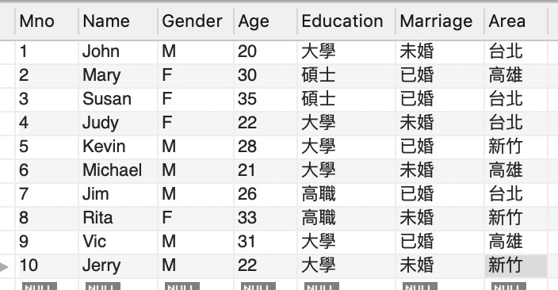
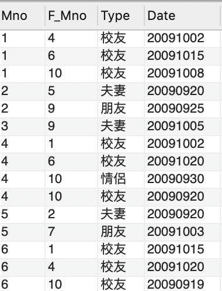

# MySQL練習題目


## 小明與他的朋友們
- 表格名稱：member


- 表格名稱：member_friendship



## 題目1
Q:找出住在台北，然後有住新竹有朋友的人


### 解題思路

1. 如果不知道怎麼解，就先在from後面把「可能會用到的表格」還有架構列出來，例如
```sql
SELECT * 
FROM `member` as m  , member_friendship  as f
WHERE  ....
```


2. 如果又不知道怎麼解，就先用where後面把「條件」列出來，例如

```sql
SELECT * 
FROM `member` as m, member_friendship as f
WHERE m.Area= '台北' AND m.Mno = f.Mno # 先把member和member_friendship連起來）
```

3. 最後，思考一下並補上你部會的內容

```sql
SELECT * 
FROM `member` as m, member_friendship as f, `member` as n
WHERE m.Area= '台北' AND m.Mno = f.Mno AND n.Area = '新竹' AND n.Mno = f.F_Mno
```


### 重點概念

- from 跟join類似，可以把不同的表格「展開合併」
- 表格不只可以跟他人合併，還可以跟自己展開合併。例如

```sql
SELECT * 
FROM `member` as m, `member` as n
```

- where 可以在表格「展開合併」後，把需要的資料條件篩選出來


## 題目2
Q:交友數量_人數>=3且照數量排名

### 解題思路

1. 如果不知道怎麼解，就先在from後面把「可能會用到的表格」還有架構列出來，例如

```sql
SELECT *
FROM member_friendship
```

2. 遇到有需要「合併計算」的時候就想到 GROUP BY

```sql
SELECT mno, count(*) AS ppl
FROM member.member_friendship
GROUP BY mno
```

3. 遇到「合併計算又要篩選」的時候，就想到「合併計算」

```sql
SELECT mno, count(*) AS ppl
FROM member.member_friendship
GROUP BY mno
HAVING count(*)>=3
ORDER BY count(*) DESC;
```


### 「合併計算」重點概念

- 遇到有需要「合併計算」的時候就想到 GROUP BY，然後分別 select `名稱欄位`、`可以合併計算的欄位名稱`
- 遇到「合併計算又要篩選」的時候，就想到 HAVING
- 遇到需要「排序」的時候就想到 ORDER BY

## 題目3
Q:沒朋友的人

```sql
SELECT *
FROM member.member AS m left join member.member_friendship AS f on m.mno=f.mno
where f.F_Mno is null
```

### 解題思路

1. 如果不知道怎麼解，就先在from後面把「可能會用到的表格」還有架構列出來，例如

```sql
SELECT *
FROM member_friendship
```

2. 結果發現不能用 from 在 where 篩選，因為我要找沒朋友的人，只能用`left join`來先合併過

```sql
SELECT *
FROM member.member AS m left join member.member_friendship AS f on m.mno=f.mno
WHERE f.f_mno is null
```

### 「left join」重點概念

- 如果「合併」的時候會遇到有一邊會有空值，就必須使用「left join」而不能單純的合併
- 並且使用 `on` 來告知規則


### 建立表格補充

``` sql
CREATE TABLE `member` (
  Mno decimal(2),
  Name varchar(10),
  Gender varchar(10),
  Age decimal(2),
  Education varchar(10),
  Marriage varchar(10),
  Area varchar(10),
  CONSTRAINT pk1 PRIMARY KEY(Mno)); 
    
CREATE TABLE member_friendship (
  Mno decimal(2),
  F_Mno decimal(2),
  Type varchar(10),
  Date varchar(10),
  CONSTRAINT pk1 PRIMARY KEY(Mno, F_Mno, Type),
  CONSTRAINT fk1 FOREIGN KEY(Mno) REFERENCES `member`(Mno),
  CONSTRAINT fk2 FOREIGN KEY(F_Mno) REFERENCES `member`(Mno));
  ```