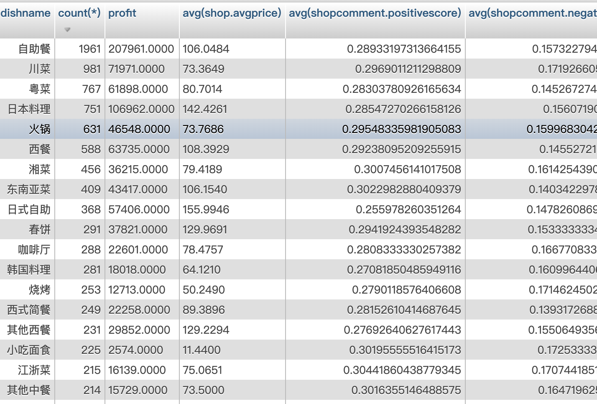
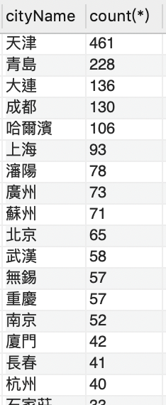
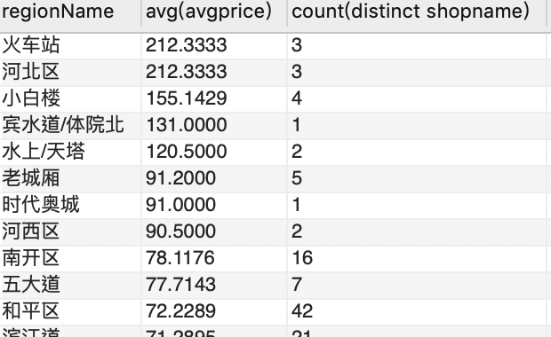
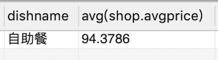
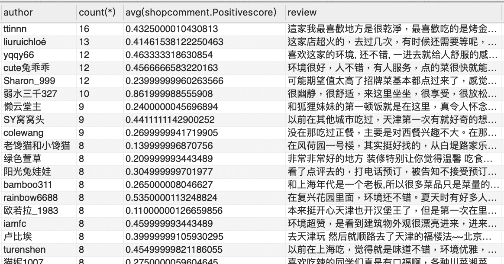
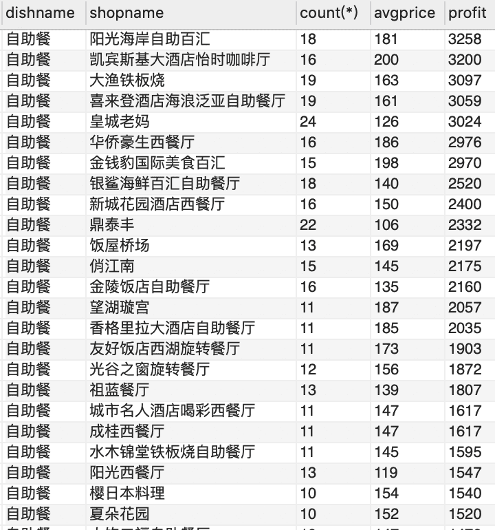
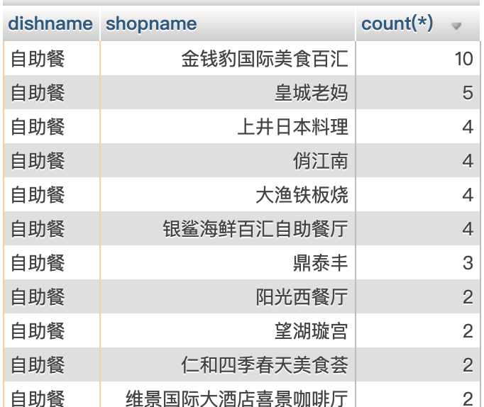

# 菜色分析

題目：富二代想要進軍大陸市場，還未沒有決定產品，因此他想知道可以
- 可以推出什麼菜色？
- 最有市場潛力城市？
- 應該選擇該城市中哪個區域作為第一個進入市場？
- 合理的定價範圍？
- 可以邀請哪些網紅試吃？
- 在進入市場前，大陸有哪些成功的該菜系可以做市場研究？

請資料庫管理的同學幫忙，拜託拜託。

### 1.大陸地區最有市場潛力最好的菜色是什麼？

建議以「自助餐」（臺灣翻譯：吃到飽）作為進入的菜系，因為「自助餐的市場規模較大」
- 其中`市場規模(marketing size)`大約等於「需求量 X 平均單價」
    - 其中「需求量」，是以該菜系的「評論數量」（討論熱度）作為指標
    - 其中「平均單價」，直接以「該菜系的餐廳之平均客單價」作為直接計算



SQL指令：列出每個菜系的「評論數」

```sql
select dish.dishname,
count(*),
avg(shop.avgprice) * count(*) as profit,
avg(shop.avgprice) from 
shop.shopdish, 
shop.shopcomment,
shop.shop,shop.dish 
where dish.dishid = shopdish.dishid 
AND shopdish.shopid = shop.shopid 
AND shop.shopid = shopcomment.shopid 
group by dish.dishname 
order by  profit DESC
```
### 2.大陸地區哪個城市對於「自助餐」的需求最高？

建議以「天津」作為進入城市，因為相對於其他城市，天津城市對於自助餐的「需求量」最高
- 其中我們以「城市自助餐的評論數量」（討論熱度）作為需求量指標



- SQL指令:列出「自助餐」評論數最多的幾個城市
```sql
--- 需求最高的城市
select cityName,count(*) from 
shop.dish,
shop.shopdish, 
shop.shop,
shop.shopcity,
shop.city,
shop.shopcomment
where dish.dishid = shopdish.dishid AND 
shopdish.shopid = shop.shopid AND 
shopcity.shopid = shop.shopid AND 
shopcity.cityid = city.cityid AND
shopcomment.shopid = shop.shopid AND
dish.dishname = "自助餐"
group by cityName
order by count(*) DESC

```

### 3.應該進入「天津」哪個區域？

可以「河北區」作為進入的區域，因為
- 雖然天津市具有高需求量，但「河北區」沒有其他自助餐的競爭對手，因此具有競爭優勢
- 考量到人群的消費力，也可以發現「河北區」的人均消費力也最高
  -  我們以區域的「餐廳平均消費額」作為人均消費力的指標


SQL指令:列出天津市「有販售自助餐的所有區域」


```sql
select dishname, regionName, count(*) from 
shop.dish,
shop.shopdish, 
shop.shop,
shop.shopcity,
shop.city,
shop.shopregion,
shop.region
where 
dish.dishid = shopdish.dishid AND 
shopdish.shopid = shop.shopid AND 
shopcity.shopid = shop.shopid AND 
shopcity.cityid = city.cityid AND
shopregion.shopid = shop.shopid AND
shopregion.regionid = region.regionid  AND
dish.dishname = "自助餐" AND
city.cityname = "天津"
group by regionName
order by count(*) DESC
```


- SQL指令:列出天津市所有區域「餐廳平均消費額」



```sql
select regionName ,avg(avgprice), count(distinct shopname) from 
shop.dish,
shop.shopdish, 
shop.shop,
shop.shopcity,
shop.city,
shop.shopregion,
shop.region
where 
dish.dishid = shopdish.dishid AND 
shopdish.shopid = shop.shopid AND 
shopcity.shopid = shop.shopid AND 
shopcity.cityid = city.cityid AND
shopregion.shopid = shop.shopid AND
shopregion.regionid = region.regionid  AND
city.cityname = "天津"
group by regionName
order by avg(avgprice) desc
```


### 4. 河北「自助餐」的合理定價範圍？

可以考慮訂在100～200，因為
- 「自助餐」的全國平均價格為93元
- 根據問題(3)河北區的平均消費額為212元

SQL指令：列出「自助餐」全國平均價格


```sql
select dish.dishname, avg(shop.avgprice) from
shop.shop,
shop.dish,
shop.shopdish
where dish.dishid = shopdish.dishid 
AND shopdish.shopid = shop.shopid 
AND dish.dishname = "自助餐"
group by dish.dishname
order by avg(shop.avgprice) DESC
```


```sql
select dish.dishname, avg(shop.avgprice) from
shop.shop,
shop.dish,
shop.shopdish
where dish.dishid = shopdish.dishid 
AND shopdish.shopid = shop.shopid 
AND dish.dishname = "自助餐"
group by dish.dishname
order by avg(shop.avgprice) DESC
```


### 5. 可以邀請哪些「天津」的美食評論網紅？

可以邀請ttinnn、liuruichloé、yqqy66、cute兔乖乖、Sharon_999、弱水三千327，因為他們是天津市評論數最多的人
- 其中弱水三千327的平均評分最高，可以優先邀請
- Sharon_999的平均評分最低，必須要小心邀請



- SQL：列出天津市評論數最多的人
```sql
select author, count(*),avg(shopcomment.Positivescore), review from
shop.shop,
shop.dish,
shop.shopdish,
shop.shopcomment,
shop.shopcity,
shop.city,
shop.shopregion,
shop.region
where dish.dishid = shopdish.dishid 
AND shopdish.shopid = shop.shopid 
AND shopcomment.shopid = shop.shopid 
AND shopcity.shopid = shop.shopid 
AND shopcity.cityid = city.cityid 
AND shopregion.shopid = shop.shopid 
AND shopregion.regionid = region.regionid 
AND city.cityname = "天津"
group by author
order by count(*) desc
```

- SQL：列出活躍所有吃自助餐很常評論的人
> 棄用，因為發現最多只有3人

```SQL
select author, count(*), review from
shop.shop,
shop.dish,
shop.shopdish,
shop.shopcomment
where dish.dishid = shopdish.dishid 
AND shopdish.shopid = shop.shopid 
AND shopcomment.shopid = shop.shopid 
AND dish.dishname = "自助餐"
group by author
order by count(*) desc
```

### 6. 在100-200價位有哪些成功的「自助餐」企業可以參考？

- 可以參考`陽光海岸自助百匯`，因為它是`平均單價*分店數量`最高的自助餐店
- 可以參考`皇城老媽`，因為它是數量最多的連鎖自助餐



SQL1:根據「單價*評論數量」列出大陸地區的自助餐店
```sql
select dish.dishname,shopname,count(*),shop.avgprice, count(*)*shop.avgprice as profit from 
shop.shopdish, 
shop.shopcomment,
shop.shop,shop.dish 
where dish.dishid = shopdish.dishid 
AND shopdish.shopid = shop.shopid 
AND shop.shopid = shopcomment.shopid 
AND dish.dishname = '自助餐'
AND shop.avgprice <=200 AND  shop.avgprice >=100
group by shopname
order by profit DESC
```


SQL1:列出大陸地區「連鎖數量」最多的自助餐店
```sql
select dish.dishname,shopname,count(*) from 
shop.shopdish, 
shop.shop,
shop.dish 
where dish.dishid = shopdish.dishid 
AND shopdish.shopid = shop.shopid 
AND dish.dishname = '自助餐'
AND shop.avgprice <=200 AND  shop.avgprice >=100
group by shopname
order by count(*) DESC
```