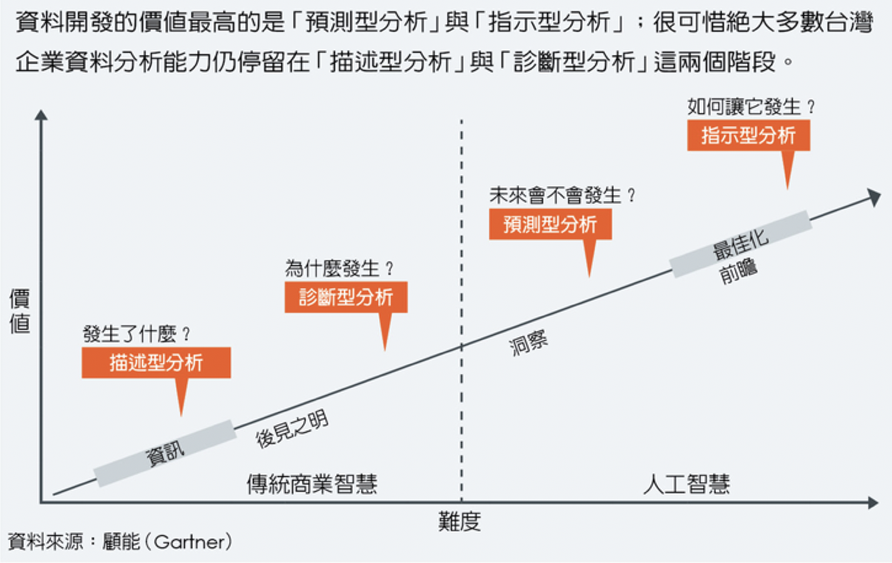
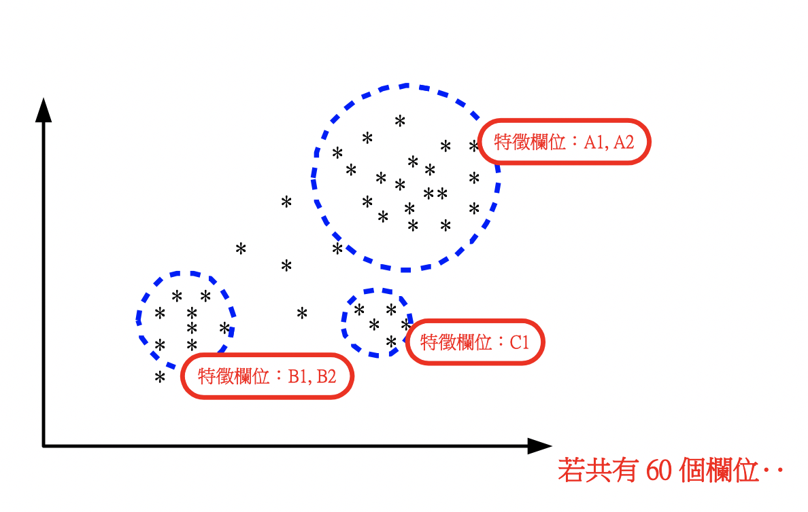
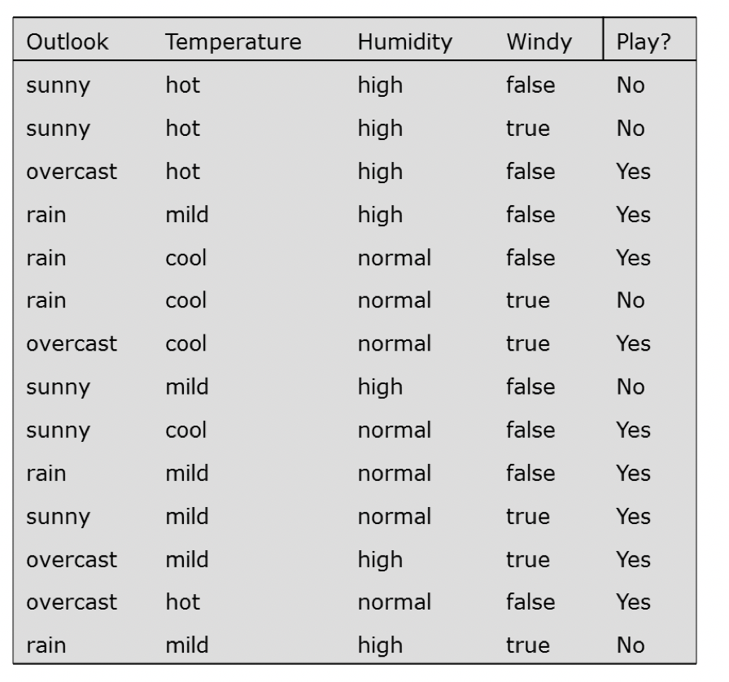
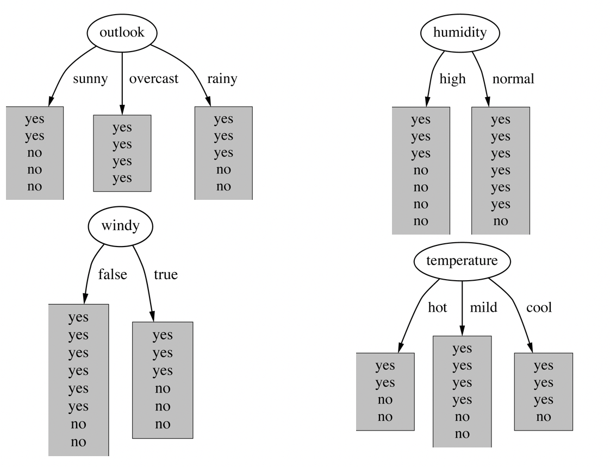
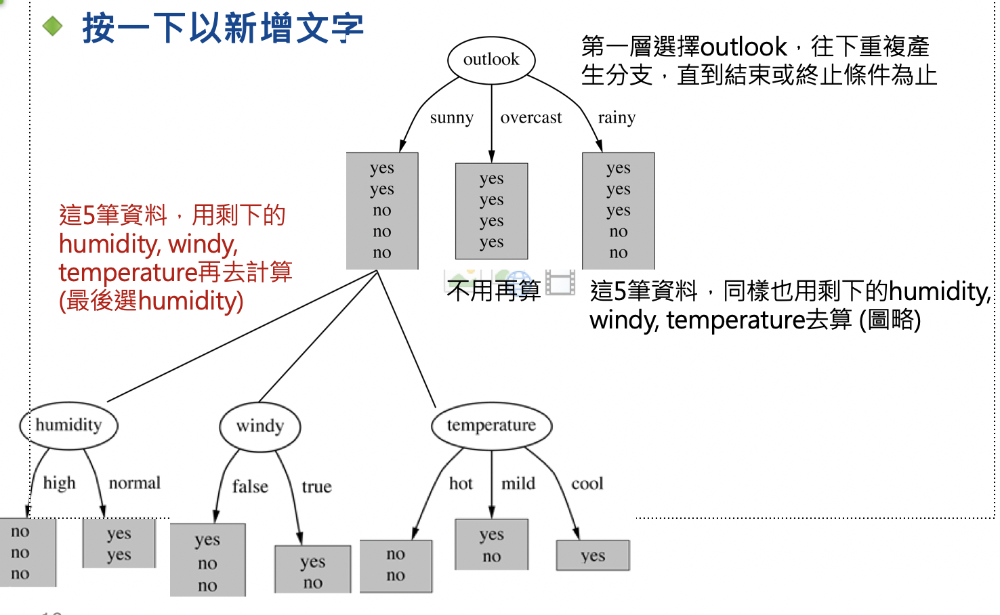
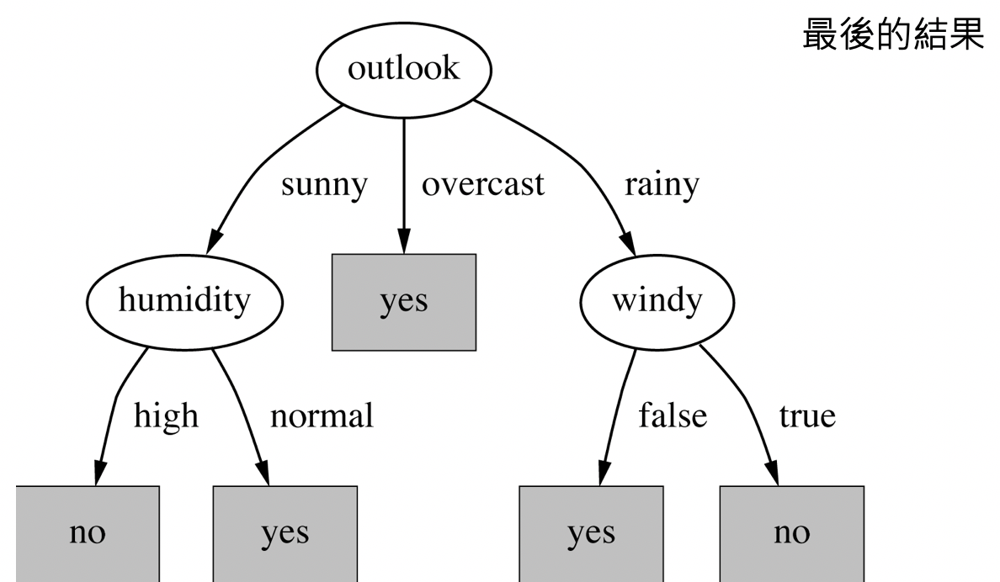

# 常見的巨量資料與分析

## 怎樣算好的分析？

價值從低到高，難度從低到高

- `敘述性分析`：過去發生的事情？（人均單價、消費次數、評論次數）
- `診斷型分析`：為什麼過去會發生？
- `預測型分析`：未來可能發生什麼？
- `指示型分析`：如何讓我們想要的未來發生？

## 常見的統計方法？

1. `關聯分析`（Association rule）：找出資料之間的關係。

- 尋找每筆交易中被同時購買之商品的關聯性（購物籃分析）：10個買麵包的人8個買牛奶、they also buy、they also watch、they also in
- 尋找消費者與商品之間關聯性：iPhone7 Plus → 男性、上班族、年收入80-120萬

2. `群集分析`（Clustering）：通常先分群再做敘述性分析，會比直接做敘述性分析來得好。因為不同群的資料的差異太大，可能會得出奇怪的結論。

比如說：每個人類平均有一顆蛋蛋，就是因為沒有分群及分析，把男女一起算，所以會得出奇怪的結論。

`分群演算法`（K-means算法）：把資料進行分群

- 挑兩個點A,B：離A比較近的標成A，離B比較近的標程B
- 找出資料的重心C：離C比較近的標成C，離B比較近標成B>

3. `分類預測`（Classification）：利用資料進行預測

`決策樹分析`：假設，有一個網球選手會靠一些機制決定今天要不要練網球，然後我們想找出來他的決策機制，就可以使用決策樹分析

如果每加入一個變數，可以增加`結果的一致性`，那他就是一個更好的決策變數。

### 資料推薦來源

- 政府資料開放平臺（即時、數量、質量評分全球最高）
- kaggle

### 套件推薦

- The R Project for Statistical Computing
- Weka : Data Mining Software in Java
- scikit-learn: machine learning in Python
- SAS Enterprise Miner (EM)
- Business Analytics and Business Intelligence Software

### 推薦教學

- python連接mysql資料庫

