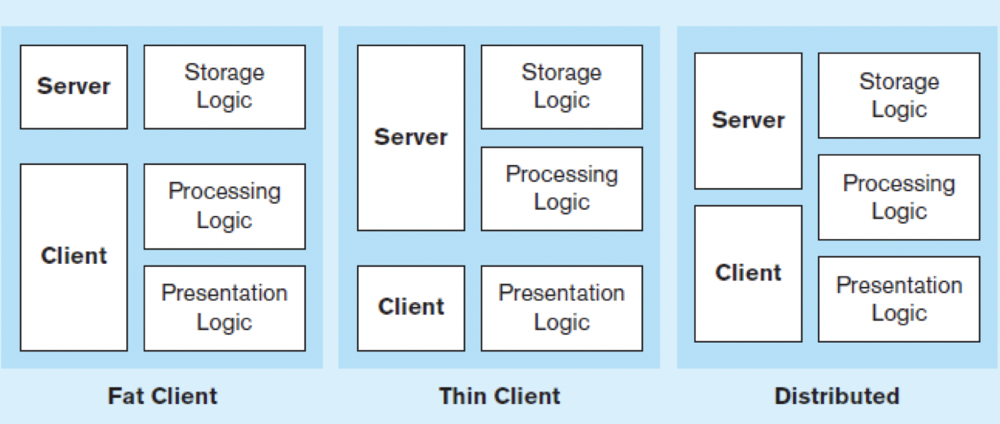

# 資料庫架構

- DBMS：操作資料儲存的系統，比如說MySQL是DBMS，他可以去操作底層硬體的資料儲存方式，也可以連接到遠端的機器去操作資料儲存。



- Fat Client：主要由Client負責運送，但會導致Client的工作量很重
    - Server：儲存資料
    - Client：去Server用SQL拿資料＋運算＋畫面呈現
> 每個Client都要裝DBMS（像是MySQL）去操作資料庫
> 缺點：
- Thin Client：主要由Server負責儲存資料＋資料存取＋運算
    - Server：儲存資料＋資料存取＋運算
    - Client：畫面呈現
> 像是ATM就屬於Thin Client架構，介面只有很簡單的功能，完全讓遠端伺服器操控。
> 缺點是Serve可能loading太重。
- Distributed：平均分配運算
    - Server：儲存資料＋資料存取＋部分資料運算
    - Client：畫面呈現＋部分資料運算

- One tier

- Two-Tier Database Server
    - Client：讀取資料庫並且進行資料運算
    - Database server:儲存資料
- Three-Tier Architectures:
    - Client：呈現畫面
    - Application server：處理商業邏輯
    - Database server:儲存資料


## ODBC（Open Database Connectivity）

提供API，讓一般的應用程式可以用自己的程式語言去存取資料庫的內容。

- ODBC：提供API，讓一般的應用程式可以用自己的程式語言去存取資料庫的內容
- JDBC：
- ADO.NET：

# 資料庫機制

## ACID

MySQL資料具有ACID的性質
- A（Atomic）：transaction（交易）不能被分開，全有全無
- C（Consistent）：只要資料庫確認儲存，就會真的確認
- I（Isolated）：兩筆transaction（交易）不會互相影響
- D（Durable）：一但資料改變就是永久的


```sql
BEGIN transaction
    .
    . #中間若發生錯誤就會自動rollback
    .
END transaction
COMMIT 
```

## Concurrency Control共同控制

資料庫在共同存取時可能會遇到許多的問題，因此就需要有自己的分散式系統的演算法，控制共同存取，保持資料可以維持一致。比如說，John從A帳號1000中，提款200，最後剩下800。但同時Nissen也從A帳號提款300，剩下700，結果因為設計不當就把Nissen交易的剩餘700的資訊寫入資料庫，但此時John的交易紀錄沒有被更新上去，因此這就會產生`lost update`。

### 1. Serializability（循序排隊）

讓大家排隊使用資料庫，但這樣的作法可能會造成塞車，因為
- 台灣頻繁的資料庫的資料可能到60-100/s
- 掏寶可能到1000／s

### 2.Rollback（重回機制）

一但遇到和別人用一樣的資料，就回到上一步重新過來。
這種機制相信資料衝突的機率不多，因此可以一直重新來過。
但是對於容易碰撞的機制下，就是和使用Rollback（重回機制）

比如說，雙11產品庫存100。一個人要結帳時，這時候庫存要算100?還是99?，

### 3. Locking Machanisms（鎖定機制）

利用鎖定機制，讓所有人不會同時操作資料。

比如說如果John在使用table A的資料，這個時候John就可以在table A上面放Lock，這樣其他人就只能讀，一直到John的lock被釋放，其他人才可以寫入資料。

#### 鎖的類型
- Shared lock（Read lock）：可以同時讀，但是只能有一個人寫。
- Exclusive lock（Write lock）：不可以同時讀，也只能有一個人寫。


#### 鎖定層級

是如果一次就鎖定所有table，也會造成問題，如果`鎖定層級（Locking level）`操作性就愈低。像是如果鎖住一整個Table，那其他人就不能用。因此如果人愈多，最好就可以更進一步細分 Lock 的最小單位。（例如只鎖住record）
- Row (RID)
- Key (KEY)
- Page (PAG)
- Extent (EXT)
- Heap or B-tree (HoBT)
- Table (TAB)
- File (FIL)
- Application (APP)
- MetaData (MDT)
- Allocation Unit (AU)
- Database (DB)
- Type Of locks：


#### 死鎖(Dead lock)

Locking Machanisms（鎖定機制）可能會造成死鎖的問題。

例如：John在 Read lock 表示我要讀，Neo也放Read lock表示我要讀。之後John要改用Write lock但是發現Neo有Read lock就不能放。然後Neo也發現John有Read lock也不能放Write lock。因此導致「大家彼此等待對方」，產生所謂的Dead lock。

解決方式：
- 預防機制（Two-phase locking protocol）
  - Growing phase 逐漸增加鎖定
  - Shrinkin phase 逐步釋放鎖定
- 解鎖（unlock）：機器隨機讓一個人交易失敗，然後讓對方可以重新執行。


# Data Security 資料安全


## 常見的意外

- Human error人為錯誤：像是有人不小心Drop table
- Hardware failure硬體錯誤：像是主機板燒掉
- Software failure軟體錯誤：很少有問題，通常是當初設計有問題。

> 人跟硬體是最有可能出錯的部分

## 網路防禦

Farawall  -> IDS(intrusion Detection System)

## Client-Server Application Security

靜態網頁：
- 用HTTPS
動態網頁：
 - 使用者憑證
 - 連線安全
 - 傳輸加密
 - 人數及連線限制
 - 移除不用的程式（避免有木馬程式）

## Data Privacy

好的網站最好可以符合P3P原則（Platform for Privacy Protection）

- 誰收集資料
- 收集用途
- 誰可以使用
- 使用者可控制
- 爭議如何處理
- 如何保存資料


# NoSQL databse

NoSQL的特性是BASE 
- basically available：基本
- soft state：資料格式是比較鬆散的
- eventually consistent：短期間內資料庫可能不同步，但最後會同步。例如：資料庫


NoSQL資料庫類型

- key-value儲存：name存nissen
- 文件存儲：影片、圖片
- 網狀快速儲存：允許

推薦MongoDB、Cassandra

- scale up：把資料庫變大
- scale out：把資料庫擴充

### 分散式儲存


在安裝MySQL的時候會問你要裝成，
- standard（單機版）
- clustered（集群版）:可以選擇誰是Master，誰是Slave。其中Master主要操作，操作完資料會自動同步到Slave
> 也可以設定為彼此互為Slave、Master

Clustered雖然可以解決分散式儲存的問題，但卻沒有解決分散運算的問題，比如說要算1~10000000的有多少質數

## 分散式運算

- Hadoop：是一個可以進行分散式運算的架構，比如說要算1~10000000的有多少質數，可以把這些數字分給不同的機器算，算完在統合。


- 


## 資料分析

-

Map Reduce

## BI & A

BI&A 1.0：結構性資料
BI&A 2.0：非結構性資料（例如：文章、討論）
BI&A 3.0：機器或sensor產生大資料，特別在5G物聯網時代資料量會暴增。(例如：感應器、攝影機、車子資料）


傳統統計和機器學習

時間序列分析