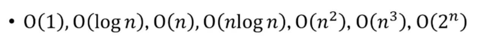
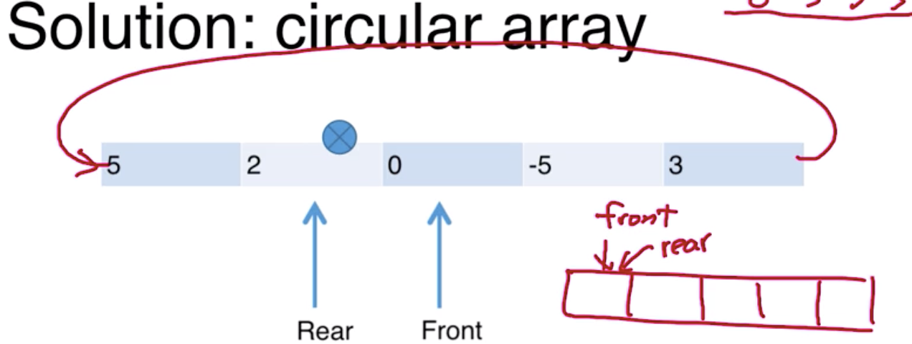

# 資料結構與演算法

- 授課老師：蔡欣穆
- 時間：週二（13:20-16:20)

---

- 資料結構
- 演算法
    - 擁有線的的步驟解決問題，是「時間」相關
- 如何分析程式是否寫得好
    - 通常時間愈少，表示程式寫得愈好
        - 執行的時間通常是相對於資料輸入的大小
- Performance Evaluation
    - 常見的順序

        

        [DSA](https://www.notion.so/23967355c7c549899638f0aca5113e5b)

        - 我時常會卡住的部分：
            1. 「為什麼g(n)可以乘上c，這樣不是很狡猾嗎？」
            答案：「c只是為了方便比較g(n)和f(n)的成長速度，重點是去看兩個函式成長速度。因為如果兩個的成長速度量級不一樣，c就算設定的很大，g(n)在後面n很大的時候，還是會被f(n)超過」
            2. 「f(n)=O(g(n))中的『等於』是什麼意思？」

                答案：是「屬於」的意思，O(g(n))是**「一群**上界為g(n)的函式」，而f(n)就是其中一員。

        - 變化曲線

        

    - 通常worst case會跟average case差不多
- Stack & Queue：它們是array的某一種延伸
    - Stack：First in , Last out 一碟盤子網上堆疊
        - 概念：有兩個箭頭指最上面，是一個有順序，開口朝上的陣列
            - system stack，當作業系統在運行程式時，就是使用stack的機制再處理

                    Void vegatable(){
                     int a
                     if(a){
                      vegetable()
                     }
                     return // here2
                    }
                    
                    vegatable()
                    //here
                    

                程式運行的時候，會由下往上紀錄資訊（想像以下是一個stack)

                5. previous frame pointer（上一個stack的範圍，所以是1的位址）

                4. return address（要記錄執行完if，裡面的vegatable後，要回到哪裡執行？在這裡就是here2的位址）

                3. int a （是最外層的a變數）

                2. previous frame pointer（上一個stack的範圍，也就是上上一個return在哪裡）

                1. return address（當我運行完最外層，這個vegatable後要回到哪裡執行？因此這裡是會紀錄註解中here的位址）
        - stack的使用時機：希望「方向相反」
        - 常見的stack題目
            - 1.Palindrome（回文題）:
                - 例如「Noon,civic, raceacar ,madam」 就可以用stack來去看這些字串是否是回文

                        把racecar 拆成0-2、4-6一組
                        ・把0-2放到stack
                        ・pop出來
                        ・逐一跟4-6進行比對
                        
                        如果都是正確，就是回文

            - 2.Balanced Parentheses（括號題）

                    假設資料是 (([[]]))
                    
                    - 當遇到左括號就把他放到stack中
                    - 當遇到右括號，就把左括號的資料拿出來對照
                    - 如果比對都成功，表示資料是成對的

            - 
            - 把記憶體給一塊
            - 箭頭放在最底下
            - 如果stack overflow
                - Pop：把資料拿出來
                - Push：把資料放進去
        - C的實作

                要記錄箭頭
                
                struct ArrayStack{
                 int top;
                 int capacity
                 int *array
                }
                
                struct ArrayStack *CreateStack(){
                 struct ArrayStack *s = malloc(sizeof(struct ArrayStack))
                	if(!s) return NULL;
                  s->top=-1
                  s->array=(int*)malloc(s->capacity*sizeof(int))
                	if(!S->array)return NULL
                	return s;
                }
                
                int isEmptyStack(struct ArrayStack *S){
                	return (s->top==-1)
                }
                
                int IsFullStack(struct AttayStack *s){
                	return (s->top==s->capacity-1)
                }
                
                void Push(struct ArrayStack*s , int data){
                 if(IsFullStack(S))
                  print("stack overflow"
                 else
                   s->array[++s->top] = data
                }
                
                void Pop(struct ArrayStack*s){
                 if(isEmptyStack(S)){
                  print("stack is empty")
                 }
                 else
                   return (s->array[S->top--])
                }

    - Queue：First in, First out
        - 程式
            - EnQuence 把元素放進去
            - DeQuene 把元素拿出來
        - Ｃ實作
            - 利用circular-array進行實作

            

    - 

- Link-listed：有順序的資料結構
    - 為什麼需要Link-List？
        - 因為Array雖然改頭尾簡單，但是要中間插入/刪除會很麻煩，會需要很多搬移的成本
        - 時間複雜度

            [DSA](https://www.notion.so/4f6f3bf5f16645c89f2ffcbb6f329c2d)

    - 如何實作
        - 可以用array實作link-list
- String Matching：在大字串裡面搜尋小字串
- Sorting：排序資料，有很多方法
- Tree：階層型的資料結構
- Heap：
- Graph basic
- Hash table：如何快速找到資料

## 問題

- 一個deep copy的問題?

            int *a;
            int *b;
            int *c;
            printf("%p\n", a); // add1
            printf("%p\n", b); // add2
            printf("%p\n", c); // add3
            b = a;
            printf("%p\n", a);  // add1
            printf("%p\n", b);  // add1
            printf("%p\n", c); // add3
            a = c; // add3
            printf("%p\n", a);  // add3
            printf("%p\n", b);  // ??? add1 or add3
            printf("%p\n", c); // add3
            return 1;

- 這是什麼

        struct ListNode *ReverseList(struct ListNode *head)

- 如何反轉link-list

        struct ListNode *ReverseList(struct ListNode *head){
        
                struct ListNode *cur;
                cur = head.next
        
                struct ListNode *next;
                next = cur.next
        
                struct ListNode *prev;
                prev = head
        
        
                while(next =!NULL){
                    prev = new ListNode(*(cur))
                    cur = new ListNode(*(next))
                    next = next.next
                    cur.next = prev
                }
        
                struct ListNode *lastNode;
        
                lastNode = cur
        
                return lastNode
        
            }

- 如何用陣列實作link-list宣告

        // node struct
        
        struct node { 
          int value; 
          int next; 
        };
        
        // 假設有一個陣列如下
        
        struct node linkList[3];
        
        //假設linkList[0]->linkList[1]的關係是連續的，現在要加上linkList[2]在他們中間
        
        linkList[2].value = 想加的值
        
        linkList[2].next = 1 //指向linkList[1]
        
        linkList[0].next = 2 //讓linkList[0]指向linkList[2]