# Python基礎解題

- 程式解題考驗的能力
    - 正確性
    - 可靠性：是否考慮到各種例外
    - 速度：是否可以快速寫程式
    - 效率：是否用太多記憶體或是CPU
        - 通常IOT跟大數據會比較在意記憶體
        - 一般leetcode比較是跑太慢才不過
- 準備方式
    - 背單字
    - 一題多寫幾遍
- 解題注意事項
    - 多背單字
    - 知道底層的寫法，例如chr()跟
- 常用技巧
    - 計數器 count
- 複雜度Big-O
    - 最常見的複雜度通常是O(n)，想要是O(logn)這種作弊的狀態，通常會需要經過特殊整理，才有機會利用「二分」的特性這麼快（比如說，先排序好才進行搜索）。
    - 通常科學家能把O(n²)→ O(nlogn) 就是萬幸，像是加上一些「二分」的特色

    [常見的複雜度](https://www.notion.so/0504626f2c354465b19994cd2879dbda)

    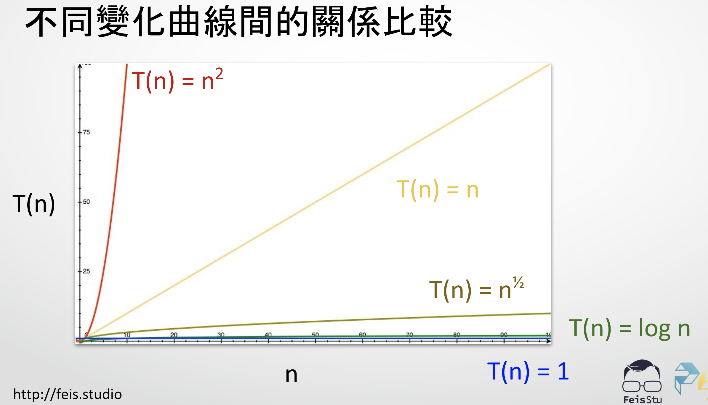

- **字元與編碼**
    - 特性
        - 字串String與字元Character：在python中，一切都是字串
        - Python預設的編碼是Unicode
            - Unicode：各種中文英文都有對應編號
            - ASCII：是Unicode的子集，例如 A是65  a是97
    - 重要Method
        - 重要特性：每一字串的運算，都會造成新的字串，因此會造成資源的浪費

                a="abc"
                a= a+'d'
                
                // 在記憶體中會產生 'abc' 'abcd' 兩的字串

        - 底層的寫法ord(i),chr(i)
            - ord(i) ：得到字元編號
            - chr(i) ：得到編號的字元
            - 大寫轉小寫

                retrun chr(ord(s)+32)

        - 要記的寫法
            - s.lower() 轉小寫
            - s.upper() 轉大寫
            - s.islower() 是小寫
            - s.isupper() 是大寫
            - s.istitle() 第一個大寫
            - s.find()
            - s.count()
            - s.isalnum() 是否是數字/英文
            - int() 字串轉數字
            - str() 數字轉字串
            - ''.join(['a','b''c']) 陣列轉字串  str(['a','b','c']會變成 ['a','b','c']字串
        - 切片運算 s[1:]

                a='abc'
                print(a[1:2]) //印出a[1]

            - 切片運算不會有index error，解題很實用

                a = 'abc'
                print(a[1:10]) // 會印出abc，後面就不管
                print(a[4])// 會印出error

            - a[1:] 印出1到最後面

                a = 'abc'
                print(a[1:]) // 會印出abc

            - s[::-1] 可以反轉字串

                a = 'abc'
                print(a[::-1]) // 會印出cba

        - 每一個元素都有「兩個」（正負）編號

                a = 'abc'
                a[-1] //c
                a[-2] //b
                a[-3] //a

        - Python的底層是c，所以當用lower()的時候，其實他用c再幫你處理，所以叫ord,chr其實不一定會更快，但還是要知道怎麼寫
    - String是文字的sequence
        - 每個字元使用Unicode編碼儲存
    - 擷取String的3種方法
        - 如果只想知道內容

                for i in s
                	print(i)

        - 如果主要想要知道編號

                for i in range(len(s)):
                	print(i,s[i])

        - 如果想知道編號＋內容

                for i,c in enumerate(s):
                	print(i,c)

- **陣列(Array)**
    - 陣列最電腦「最自然的儲存方式」，把資料存在一段「連續的記憶體」空間中
        - 一般來說「陣列」不能隨意更改大小，可能有Array2接續在後面，因此如果大小不夠，就必須要搬移記憶體

            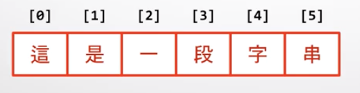

        - 通常「陣列」一開始建立時，就會幫忙儲存陣列大小len()，這樣計算時就不需要去一個掃描去算大小（「以空間換時間」）

            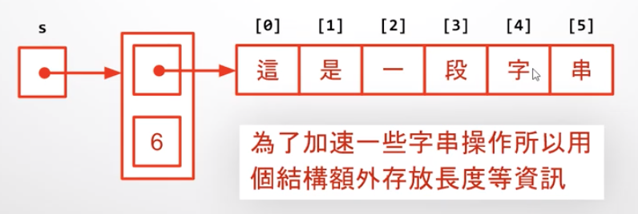

    - 動態陣列（dynamic array）
        - 當陣列大小改變，超過原本的範圍，就必須把記憶體搬家，這就是動態陣列
        - 改進方式(1)
            - Python一開始先配置較多記憶體空間，讓重新配置記憶體的機會降低。但重新配置時，會直接配置2倍的大小（平均起來複雜度O(1)）
            - 當一個記憶體沒有被指向，他記憶體就會被回收

        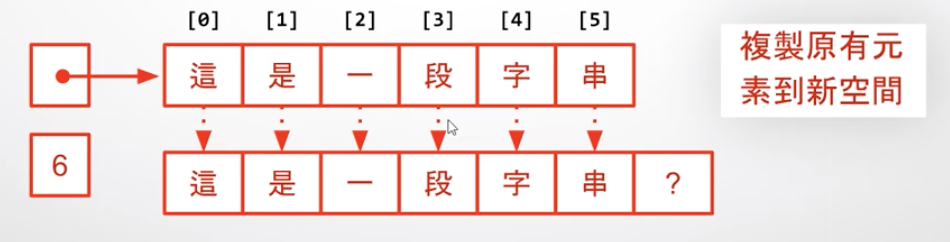

    - **字串(string)** ＊Python的一種唯獨陣列
    - **列表(list)** ＊Python的一種陣列
        - list是一種「動態陣列」，當滿了就會重新搬家，但下一次會開一個2倍大的空間

                s = list('這是一段字串')

            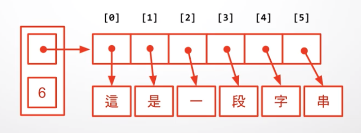

        - 時間複雜度
            - 索引查詢（比如說找出list[3]，時間複雜度是O(1)）
            - 切片 O(n)
            - 串接 O(n)
            - 循序存取(loop)是 O(n)
            - 檢查 3 in [1,2,3,4,5] 是 O(n) 會掃一遍
        - 常見

                假設a,b都是列表
                a = a+b // 會產生一個a,b之外新的記憶體空間，然後讓a指向該空間
                a += b // b會把東西加到a空間後面（雖然有可能要搬家，但至少不會每次都開新的記憶體空間）
                

- **雜湊表(Hash table)**
    - 適合情境「進行快速查詢」，而不需要O(n)的掃過一遍程式
    - 雜湊表就是一種映射，有key-value的對應關係
    - Dictionary是一種雜湊表的實作，每個key經過雜湊函數（hash function)＋求餘被轉換成一個index（0,1,2,3,4...n），然後就可以對應到特定的數值

            ・"Mary"->hash()變成一組數字 x
            ・整數x ->除以陣列長度並求於數，會得到index
            ・index->去陣列找對應的value 

        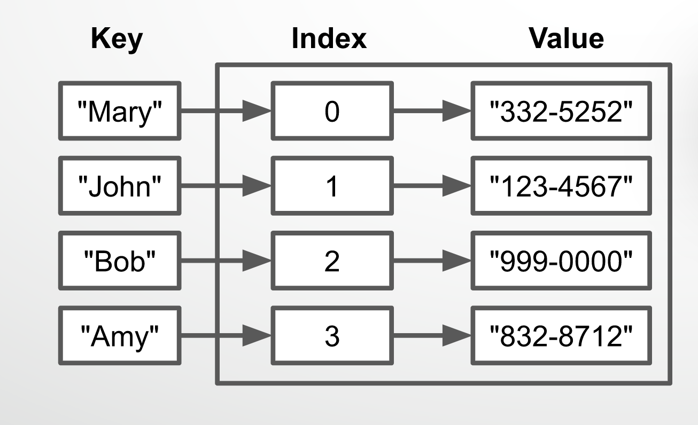

    - 為什麼不把每個key直接指定對應的0~n的index就好？
        - 因為這樣的hash的複雜度會變成O(n)如下

            if x == "Mary": 
            index=0
            
            if x == "John": 
            index=1
            
            if x == "Bob": 
            index=3

    - 有可能key轉換到index後，會是同樣的數值，因此這時候就會把這個對應往後串下去
        - 最好的狀況複雜度是O(1)，就只會對應一個index。最糟糕的複雜度是O(n)，大家都對應到同一個index，所以就只好一個問問「誰是Mary」

        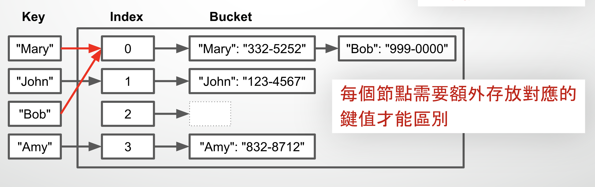

    - Python字典的應用
        - 在使用count的時候，搜尋的速度是O(n^2)，每一次都要去搜一回

            class Solution:
                def firstUniqChar(self, s: str) -> int:
                    for i,c in enumerate(s):
                        if s.count(c)==1:
                            return i
                    return -1

        - 建立一個雜湊表，搜尋的速度是O(n)，建立雜湊表示O(n)但搜尋的時候是O(1)

            class Solution:
                def firstUniqChar(self, s: str) -> int:
                    m ={}
                    for c in s:
                        if c in m:
                            m[c] += 1
                        else:
                            m[c] =1
                    
                    for i,c in enumerate(s):
                        if m[c] == 1:
                            return i
                    return -1

- **單向鏈結串列（linked list)**
    - 適合用在「經常新增刪除」的串列

    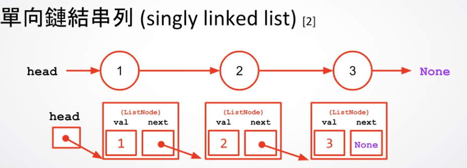

    - 假設要在最前面加一個4，可以建立一個4的listNode，head指向４，4的next指向1。
- 堆疊(Stack)
    - 堆疊是最正常的資料結構，從後面放上去，然後從後面拿走（像是list）
    - stack其實也很像是在長樹，遇到左括號就長個一node，遇到右括號就放進去配對

    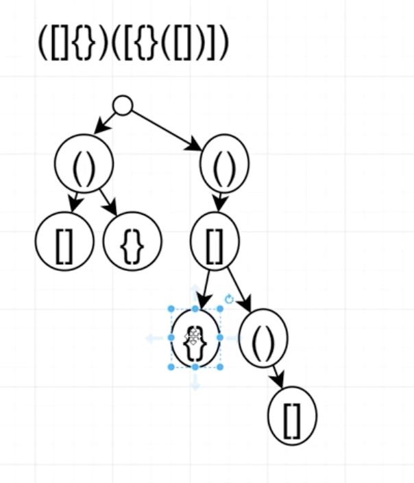

- **樹(tree)**

    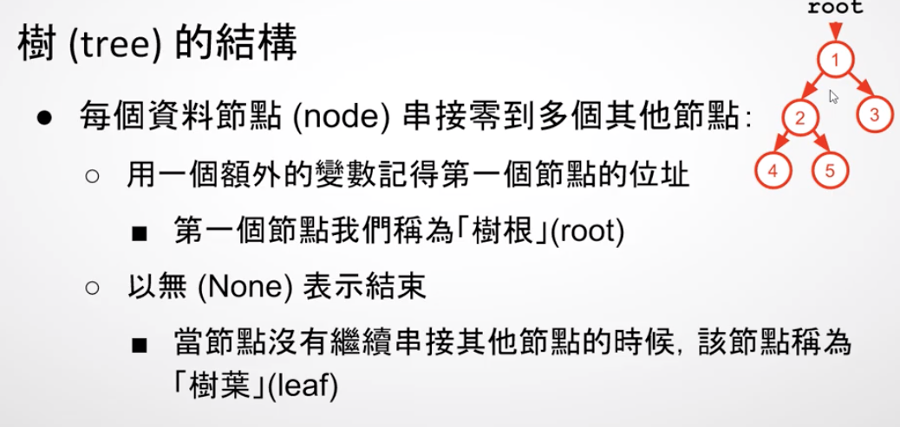

    - 樹「不能」有循環
    - 一元樹：每個ndoe指向1個節點，例如單向串列（linked list）就是一種特殊的樹
    - 二元樹：每個node指向2個節點
    - 平衡（balance)：「平衡」的意思是每一層都塞滿（第一層1個，第二層2個，第三層4個）
        - 假設有n的節點，平衡的二元樹，最高就是log(n)
    - **最大堆積（max-heap）**
        - 適合情境「會經常性的新增刪除，但是又想要知道當下最大值」
        - 整棵樹最得的值在「節點」（如下圖）
        - 原本最大值是O(n)，但用最大堆積求最大值只要O(1)，
        - 新增刪除只需要log(n)的時間

        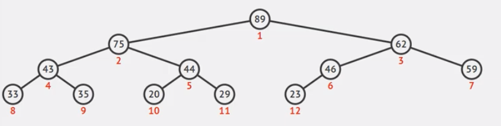

    - 二元（平衡）搜尋樹（binary search tree）
        - 每個節會比左邊子樹的節點大，會比右子樹的節點小

        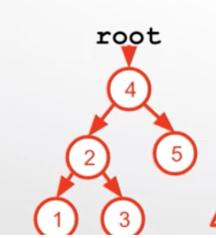

- 遞迴
    - 遞迴的條件：讓問題愈來愈小 +邊界條件
    - 每一層都會往下問，直到遇到「邊界條件」
        - 要讓問題愈來愈小

                //sum(n) = 1+2+3+....n 
                // === sum(n) 
                
                def sum(n):
                	return sum(n) //邏輯上是對的，但是會跑不完，因為一直呼叫下去

            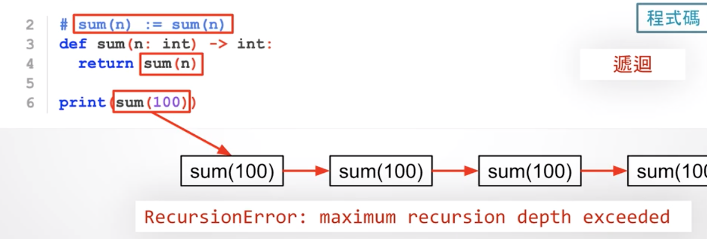

        - 要可以「往下」最後問到邊界條件

                //sum(100)
                //=== sum(99)+1
                //=== sum(n-1)+n（當n=100)
                
                def sum(n):
                	if n==1: return 1 // 邊界條件，如果sum(1)就回傳1
                	return sum(n-1)+n  //會一直往下問，直到遇到n==1

            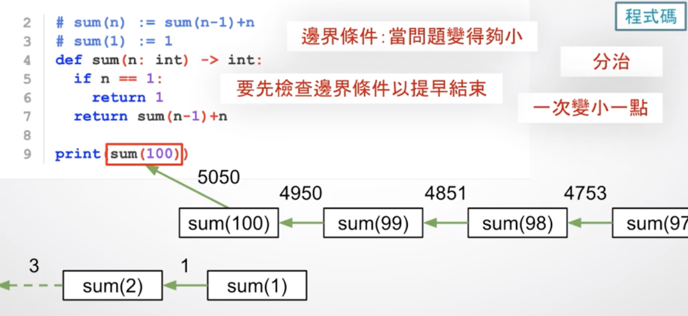

        - 也可以可以「往上」最後問到邊界條件

                // 可以往上去問邊界條件
                def sum(n):
                  if n==100: return 5050
                  return sum(n+1)-(n+1)
                  
                print(sum(90))

    - 要確保可以遇到邊界條件

            // 1+...98+99+100 
            // === sum(98)+ 99 +100 
            // === sum(n-2)+(n-1)+n （當 n=100），因此感覺可以寫成
            
            def(sum):
              if n==1:return 1
            	retunrn sum(n-2)+(n-1)+n
            
            sum(100)
            
            //但是這樣會有錯誤，因為100每次減2，就會是100, 98 ... ,4 , 2 ,0 
            // 因此不會撞到邊界條件

    - 範例： 費波那契數列（空間的優化）
        - 這樣複雜度是O(log(n))

            // 費波那契
            def fabrenachi(n):
              if n==1: return 1
              if n==2: return 2
              return fabrenachi(n-1) + fabrenachi(n-2)

        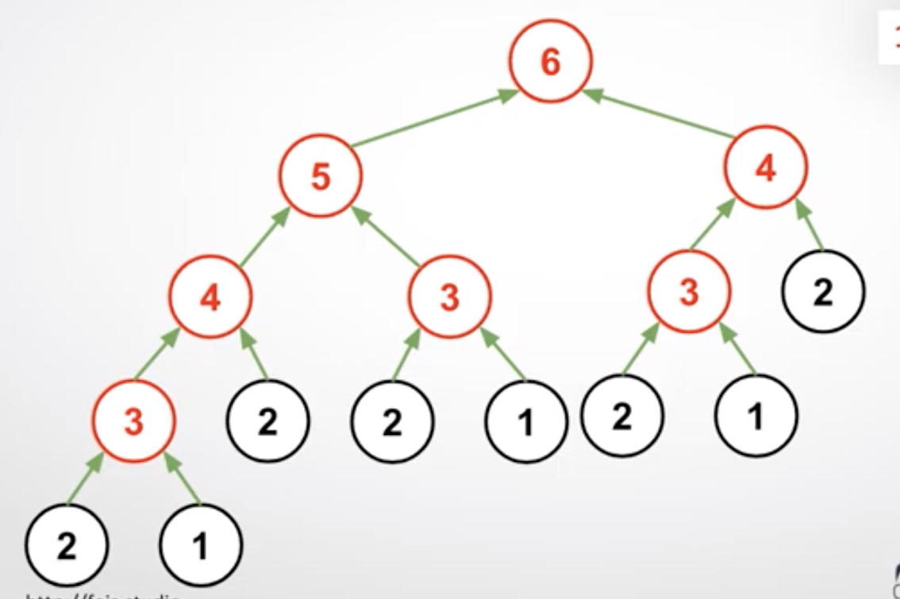

        - 但這個做法的壞處是會重複運算，像是f(1),f(2),f(3),f(4)..在不同的節點都算過了，因此可以用hash table把重複的部分處理到，這樣複雜度是O(n)

            m = {}
            def fabrenachi(n):
              if n==1:return 1
              if n==2:return 2
              if n in m: return m[n]
              m[n]= fabrenachi(n-1) + fabrenachi(n-2)
              return  m[n]

        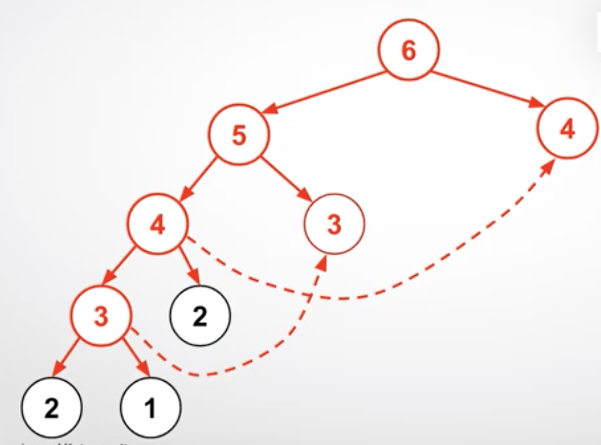

- 二元搜尋法
    - 如果資料已經排序過，就可以用二元搜尋法，複雜度是O(logn)
        - 對任意資料搜尋目標數值，複雜度是O(n)
        - 對已排序資料搜尋目標數值，複雜度O(log n)，每次從中間去問
    - 但如果資料沒有排序過，就需要先用O(nlogn)來排序，因此不一定會比較划算
    - 二元樹
        - 概念跟二元搜尋法ㄧ樣，差異是資料儲存的方式不同（用箭頭），因此新增刪除比較容易，但搜尋的複雜度依然是O(logn)
- 分治(覺得好難）
    - 把一個問題切成很多小問題，然後利用自己運作
    - 假設左邊知道答案、右邊知道答案，然後假設左邊右邊都知道答案是否自己

        class Solution:
            def maxDepth(self, root: TreeNode, val: int) -> TreeNode:
              if root == None:
                 return 0
              return max(self.maxDepth(root.left),
                         self.maxDepth(root.right))+1

- 排序
    - 泡沫排序法（Bubble sort)
        - 每次兩兩比較並且交換，每一輪會得到最大值
        - 有n個數字就n輪
        - 因此複雜度是O(n^n)
    - 合併排序法（Merge sort）
        - 左右的樹自己排好再合併

            

        - Timsort(python3的排序法)
            - 基本上是一種合併排序法
            - 最糟糕是nlogn，然後需要額外n個記憶體）
        - 
    - 計數排序法
        - 把數字放到字典裡面，然後排序

- 動態規劃
    - 是一種「解題的思維」
- Python的奇淫巧技
    - Python可以處理很大的數字，記憶體多大，數字就可以多大。
    - 可以一次賦多值

            a,b,c = 1,2,3  

    - 可以if 和 elif 都可以用
- 題目
    - 計算是不是回文
        1. 計數法

                class Solution:
                    def isPalindrome(self, s: str) -> bool:
                				count = 0
                        for i in range(len(s)//2):
                            if s[i] == s[-1-i]:
                                count+=1
                            
                        return s == len(s)//2

            2. 反證法

                class Solution:
                    def isPalindrome(self, s: str) -> bool:
                
                        for i in range(len(s)//2):
                            if s[i]!= s[-1-i]:
                                return False
                            
                        return True

- 白板題
    - 要注意「前提假設」
        - 有些人會說：複雜度的O(logn)
        但是這是假設ans+的速度跟n的大小無關，但如果加法速度跟n有關係，那複雜度就不會是O(logn)

                def zero(n:int):
                	ans =0
                	while n >0:
                		n//5
                		ans+= b
                	return ans

    - 時間複雜度、空間複雜度
        - 假設測資要計算空間複雜度，那這題的空間複雜度是n。但通常不會算，所以空間複雜度是O(1)。（因為沒有使用新的記憶體）
        - 時間複雜度是O(n)，雖然是3n，但是總體成長幅度還是跟資料量成正比

            def detectCapitalUse(word):
            	return word.isupper() or word.islower() or word.istitle()

        - Python中切片運算會產生新物件，所以空間複雜度是O(n)

            def detectCapitalUse(word):
            	return word.isupper() or word.islower() or word[1:].islower()

    - 常見問題
        - len(s)  複雜度是多少？ 
        是O(1)（因為在字串的生產過程中，就已經在某個地方紀錄長度）
    - 去思考這個題目中「最大最大的部分」是什麼
        - 通常「可能很大的部分是參數」
    - 範例題目
        - 以下面這題來說，for是O(n)，然後裡面的if固定就是4次，跟n的大小無關，所以總體就是O(n)

                def judge(mobes):
                   x,y = 0,0
                   for c in moves:
                      if c == 'U':
                         x-=1
                      elif c == 'D':
                         y+=1
                			elif c == 'L':
                				 x-=1
                			elif c == 'R':
                				 y-=1
                
                

    - 常見複雜度
        - len(s) 是O(1)
        - s.find() 是O(n)

    - 雜湊表
        - 雜湊表就是一種映射，有key-value的對應關係。
        - python的字典後面的實作就是一個陣列list，後面是0,1,2,3然後有對應的value。然後每個key會透過雜湊函數（hash function)＋求餘被轉換成一個index，然後就可以對應到特定的數值

                ・"Mary"->hash()變成一組數字 x
                ・整數x ->除以陣列長度並求於數，會得到index
                ・index->去陣列找對應的value 

            

        - 為什麼不把每個key指定對應的0~10就好？
            - 因為這樣的hash的複雜度會變成O(n)如下

                    if x == "Mary": 
                    index=0
                    
                    if x == "John": 
                    index=1
                    
                    if x == "Bob": 
                    index=3

        - 有可能key轉換到index後，會是同樣的數值，因此這時候就會把這個對應往後串下去
            - 最好的狀況複雜度是O(1)，就只會對應一個index。最糟糕的複雜度是O(n)，大家都對應到同一個index，所以就只好一個問問「誰是Mary」

            

    ## 複雜度

        a= [1,2,3,4,5]  -> a= [0,1,2,3,4,5]
        
        a[0] = 1 or a[0] -> 1
        a[0] = 0 or a[0] -> 0
        
        a = a+b // 會產生一個新的，讓a指向
        
        a += b // b會把東西加到a後面，有可能要搬家，但至少部會每次都產生新的
        
        

